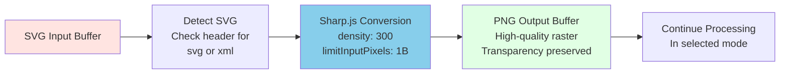
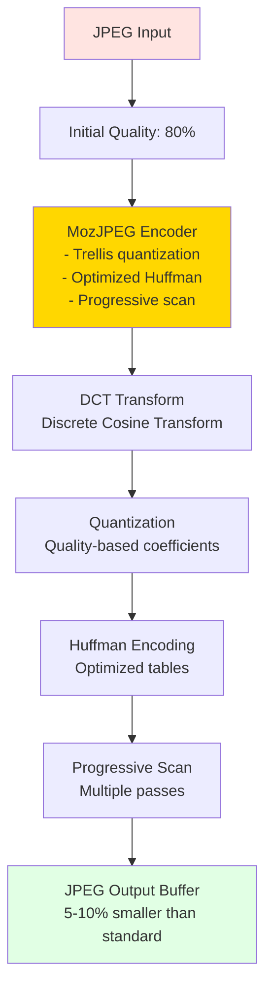
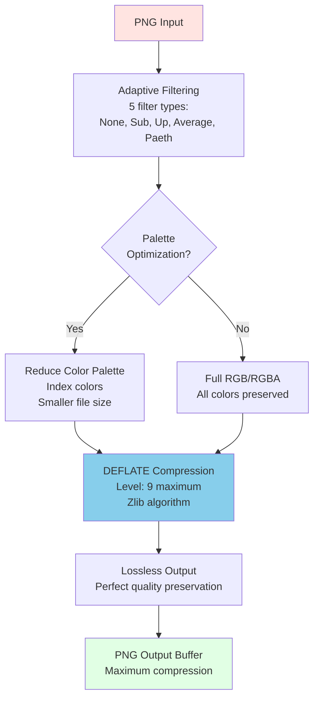
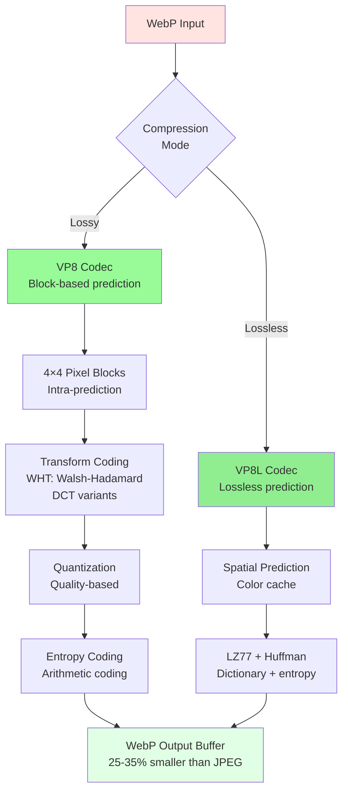

# AI Image Processing Suite - Data Flow Diagrams

This document contains comprehensive data flow diagrams for all four processing modes in the AI Image Processing Suite. All diagrams are in Mermaid.js format for easy visualization and documentation.

## Table of Contents

1. [Component Architecture](#component-architecture)
2. [AI Image Resizing Flow](#ai-image-resizing-flow)
3. [Manual Cropping Flow](#manual-cropping-flow)
4. [Upscaling Flow](#upscaling-flow)
5. [Image Compression Flow](#image-compression-flow)
6. [Format-Specific Processing Flows](#format-specific-processing-flows)

---

## Component Architecture

High-level component architecture showing how all four modes integrate with shared components and APIs.

```mermaid
graph TD
    A[Main Page] --> B[Mode Selection]
    B --> C[AI Image Resizing]
    B --> D[Manual Cropping]
    B --> E[Upscaling]
    B --> F[Image Compression]

    C --> G[ImageUploader]
    C --> H[DimensionSelector]
    C --> I[ImagePreview]
    C --> J[ProcessingStatus]

    D --> K[ImageUploader]
    D --> L[Interactive Canvas]
    D --> M[Crop Controls]
    D --> N[Zoom Controls]
    D --> O[Sidebar with Batch Items]

    E --> P[ImageUploader]
    E --> Q[Sidebar with Batch Items]
    E --> R[Scale Selector]
    E --> S[Quality Controls]
    E --> T[Batch Actions]

    F --> U[ImageUploader]
    F --> V[Sidebar with Batch Items]
    F --> W[Target Size Slider]
    F --> X[Batch Actions]
    F --> Y[Preview & Stats]

    Q --> Z[Batch Item List]
    V --> Z
    O --> Z

    Z --> AA[Image Thumbnails]
    Z --> AB[Status Icons]
    Z --> AC[Per-Image Settings]

    G --> AD[useFileUpload Hook]
    K --> AD
    P --> AD
    U --> AD

    I --> AE[useImageProcessing Hook]
    M --> AF[Manual Crop Logic]
    T --> AG[useUpscaling Hook]
    X --> AH[Compression Logic]

    AD --> AI[File Handler]
    AE --> AJ[AI Image Processor]
    AF --> AK[Crop Processor]
    AG --> AL[Upscale Processor]
    AH --> AM[Compression Processor]

    AI --> AN[Upload API]
    AJ --> AO[Process API]
    AK --> AP[Compress API]
    AL --> AQ[Upscale API]
    AM --> AR[Compress-Image API]

    AO --> AS[Gemini AI]
    AO --> AT[Sharp.js Edge Extension]
    AP --> AU[Sharp.js Cropping]
    AQ --> AV[Advanced Interpolation]
    AQ --> AW[Detail Enhancement]
    AR --> AX[MozJPEG/PNG/WebP Compression]
    AR --> AY[Iterative Quality Adjustment]

    T --> AZ[JSZip for Batch Download]
    X --> AZ

    style C fill:#e1f5ff
    style D fill:#fff4e1
    style E fill:#ffe1f5
    style F fill:#e1ffe1
    style AS fill:#ff9999
    style AT fill:#99ccff
```



---

## AI Image Resizing Flow

Detailed flow diagram for AI-powered image resizing with canvas extension and edge detection fallback.


---

## Manual Cropping Flow

Flow diagram for precision manual cropping with interactive canvas and batch processing support.

```mermaid
flowchart TD
    Start([User Upload Images<br/>Single or Multiple]) --> Upload[/Upload to /api/upload/]

    Upload --> Validate{File Validation<br/>Each File}
    Validate -->|Invalid| Error1[Display Error Message]
    Validate -->|Valid| Extract[Extract Metadata<br/>- Format: JPEG/PNG/WebP/SVG<br/>- Dimensions<br/>- MIME type]

    Extract --> CheckSVG{Is SVG?}
    CheckSVG -->|Yes| SVGPrep[SVG Frontend Preparation<br/>- Set CORS: anonymous<br/>- 200ms render delay<br/>- Natural dimension detection<br/>ManualCropping.tsx]
    CheckSVG -->|No| CreateQueue[Create Batch Queue<br/>Status: pending<br/>Unique IDs assigned]

    SVGPrep --> CreateQueue

    CreateQueue --> DisplaySidebar[Display in Sidebar<br/>- Thumbnails<br/>- Status icons<br/>- File info]

    DisplaySidebar --> UserChoice{User Action}

    UserChoice -->|Select Image| ShowCanvas[Show Interactive Canvas<br/>- Load selected image<br/>- Display crop frame<br/>- Enable zoom controls]

    UserChoice -->|Crop All| BatchProcess[Batch Processing Mode<br/>Use default settings]

    ShowCanvas --> SetDimensions[Set Crop Dimensions<br/>- Preset aspect ratios<br/>- Custom width x height<br/>- Update crop frame]

    SetDimensions --> Position[Position & Scale Image<br/>- Drag to position<br/>- Zoom in/out<br/>- Real-time preview<br/>- Keyboard shortcuts]

    Position --> CalcCoords[Calculate Crop Coordinates<br/>Client-side<br/>- Canvas drawImage<br/>- Scale factors<br/>- Offset calculation]

    CalcCoords --> SendCrop[User Clicks<br/>'Crop This Image']

    SendCrop --> CompressAPI[/Send to /api/compress/]

    BatchProcess --> CompressAPI

    CompressAPI --> DetectFormat{Detect Format}

    DetectFormat -->|SVG| ConvertSVG[Convert SVG to Raster<br/>- Density: 300 DPI<br/>- Format: PNG<br/>route.ts:70-84]
    DetectFormat -->|Raster| ProcessRaster[Process Raster Directly<br/>JPEG/PNG/WebP]

    ConvertSVG --> SharpCrop
    ProcessRaster --> SharpCrop[Sharp.js Cropping<br/>- High precision extract<br/>- Maintain quality<br/>limitInputPixels: 1B]

    SharpCrop --> FormatOut{Output Format}

    FormatOut -->|JPEG| JPEGCrop[JPEG Compression<br/>- Quality: 80-85%<br/>- MozJPEG: true<br/>- Progressive: optional]
    FormatOut -->|PNG| PNGCrop[PNG Compression<br/>- Quality: 80-85%<br/>- CompressionLevel: 9<br/>- Palette: optimize]
    FormatOut -->|WebP| WebPCrop[WebP Compression<br/>- Quality: 80-85%<br/>- Modern codec<br/>- Better compression]

    JPEGCrop --> CloudConvert{Primary<br/>Success?}
    PNGCrop --> CloudConvert
    WebPCrop --> CloudConvert

    CloudConvert -->|Fail| FallbackSharp[Fallback to Sharp.js<br/>Same format settings<br/>route.ts:66-122]
    CloudConvert -->|Success| GenMetadata[Generate Metadata<br/>- Original size<br/>- Compressed size<br/>- Compression ratio<br/>- MIME type]

    FallbackSharp --> GenMetadata

    GenMetadata --> UpdateStatus[Update Image Status<br/>Status: completed<br/>Display checkmark]

    UpdateStatus --> CheckMore{More Images<br/>in Queue?}

    CheckMore -->|Yes| NextImage[Select Next Image<br/>Status: pending]
    CheckMore -->|No| AllDone[All Images Processed]

    NextImage --> CompressAPI

    AllDone --> DisplayResults[Display Results<br/>- Before/After preview<br/>- Download buttons<br/>- Batch download option]

    DisplayResults --> DownloadChoice{Download Option}

    DownloadChoice -->|Single| DownloadOne([Download Individual<br/>Cropped Image])
    DownloadChoice -->|Batch| DownloadZip[Generate ZIP File<br/>JSZip library<br/>All cropped images]

    DownloadZip --> DownloadAll([Download ZIP Archive])

    Error1 --> End([End])
    DownloadOne --> End
    DownloadAll --> End

    style Start fill:#90EE90
    style DownloadOne fill:#FFB6C1
    style DownloadAll fill:#FFB6C1
    style End fill:#FFB6C1
    style SharpCrop fill:#87CEEB
    style Error1 fill:#FF6B6B
```



---

## Upscaling Flow

Flow diagram for image upscaling with Lanczos3 interpolation and batch processing support.

```mermaid
flowchart TD
    Start([User Upload Images<br/>Single or Multiple]) --> Upload[/Upload to /api/upload/]

    Upload --> Validate{File Validation<br/>Each File}
    Validate -->|Invalid| Error1[Display Error Message]
    Validate -->|Valid| Extract[Extract Metadata<br/>- Format: JPEG/PNG/WebP/SVG<br/>- Original dimensions<br/>- File size]

    Extract --> CreateQueue[Create Batch Queue<br/>- Status: pending<br/>- Unique IDs<br/>- Store metadata]

    CreateQueue --> DisplaySidebar[Display in Sidebar<br/>- Thumbnails<br/>- Dimensions<br/>- Clock icon pending]

    DisplaySidebar --> UserChoice{User Action}

    UserChoice -->|Select Image| ShowSettings[Show Settings Panel<br/>- Scale factor selector<br/>- Target resolution inputs<br/>- Quality slider<br/>- Per-image customization]

    UserChoice -->|Upscale All| BatchDefault[Use Default Settings<br/>Scale: 2x<br/>Quality: 80%]

    ShowSettings --> ConfigSettings[Configure Settings<br/>- Scale: 1.1x to 4x<br/>- Target width/height<br/>- Quality: 10-100%<br/>- Format: JPEG/PNG/WebP]

    ConfigSettings --> SingleUpscale[User Clicks<br/>'Upscale This Image']

    SingleUpscale --> UpscaleAPI[/Send to /api/upscale/]
    BatchDefault --> UpscaleAPI

    UpscaleAPI --> CheckSVG{Is SVG?}

    CheckSVG -->|Yes| ConvertSVG[Convert SVG to PNG<br/>- Density: 300 DPI<br/>- limitInputPixels: 1B<br/>route.ts:49-63]
    CheckSVG -->|No| GetMetadata[Get Image Metadata<br/>- Original width/height<br/>- Format<br/>- Color space]

    ConvertSVG --> GetMetadata

    GetMetadata --> ValidateDims{Validate<br/>Dimensions}

    ValidateDims -->|Target < Original| Error2[Error: Target must be<br/>≥ original dimensions]
    ValidateDims -->|Valid| ValidateScale{Validate<br/>Scale Factor}

    ValidateScale -->|< 1.1x| Error3[Error: Minimum<br/>scale is 1.1x]
    ValidateScale -->|> 4x| Error4[Error: Maximum<br/>scale is 4x]
    ValidateScale -->|Valid| Lanczos[Lanczos3 Upscaling<br/>route.ts:82-90<br/>- Kernel: lanczos3<br/>- 6×6 neighborhood<br/>- Superior edge preservation]

    Lanczos --> InitialOut[Initial Output<br/>- Format: JPEG<br/>- Quality: specified<br/>- Progressive: true]

    InitialOut --> FinalFormat{Final Format<br/>Selection}

    FinalFormat -->|JPEG| JPEGOut[JPEG Output<br/>- Progressive: true<br/>- Quality: 80% default<br/>- Optimized Huffman<br/>route.ts:106]
    FinalFormat -->|PNG| PNGOut[PNG Output<br/>- Lossless<br/>- Quality parameter<br/>- Compression: auto<br/>route.ts:100]
    FinalFormat -->|WebP| WebPOut[WebP Output<br/>- Quality: 80% default<br/>- VP8 codec<br/>- Better compression<br/>route.ts:102]

    JPEGOut --> GetFinalMeta[Get Final Metadata<br/>- Actual dimensions<br/>- File size<br/>- Format confirmation]
    PNGOut --> GetFinalMeta
    WebPOut --> GetFinalMeta

    GetFinalMeta --> UpdateStatus[Update Image Status<br/>- Status: completed<br/>- Show checkmark<br/>- Display new dimensions]

    UpdateStatus --> CheckQueue{More Images<br/>in Queue?}

    CheckQueue -->|Yes| NextImage[Process Next Image<br/>Status: pending → processing]
    CheckQueue -->|No| AllComplete[All Images Processed<br/>Display completion message]

    NextImage --> UpscaleAPI

    AllComplete --> DisplayResults[Display Results<br/>- Before/After preview<br/>- Dimension comparison<br/>- Quality metrics]

    DisplayResults --> DownloadChoice{Download Option}

    DownloadChoice -->|Single| DownloadOne([Download Individual<br/>Upscaled Image])
    DownloadChoice -->|Batch| DownloadZip[Generate ZIP File<br/>JSZip library<br/>All upscaled images]

    DownloadZip --> DownloadAll([Download ZIP Archive])

    Error1 --> End([End])
    Error2 --> End
    Error3 --> End
    Error4 --> End
    DownloadOne --> End
    DownloadAll --> End

    style Start fill:#90EE90
    style DownloadOne fill:#FFB6C1
    style DownloadAll fill:#FFB6C1
    style End fill:#FFB6C1
    style Lanczos fill:#87CEEB
    style Error1 fill:#FF6B6B
    style Error2 fill:#FF6B6B
    style Error3 fill:#FF6B6B
    style Error4 fill:#FF6B6B
```



---

## Image Compression Flow

Flow diagram for iterative image compression with format-specific optimization and batch processing.

```mermaid
flowchart TD
    Start([User Upload Images<br/>Single or Multiple]) --> Upload[/Upload to /api/upload/]

    Upload --> Validate{File Validation<br/>Each File}
    Validate -->|Invalid| Error1[Display Error Message]
    Validate -->|Valid| Extract[Extract Metadata<br/>- Format: JPEG/PNG/WebP/SVG<br/>- Original file size<br/>- Dimensions]

    Extract --> CreateQueue[Create Batch Queue<br/>- Status: pending<br/>- Store original size<br/>- Unique IDs]

    CreateQueue --> DisplaySidebar[Display in Sidebar<br/>- Thumbnails<br/>- File sizes<br/>- Clock icon pending]

    DisplaySidebar --> UserChoice{User Action}

    UserChoice -->|Select Image| ShowSettings[Show Compression Settings<br/>- Target size slider<br/>- Percentage: 10-100%<br/>- Real-time calculation<br/>- Mouse wheel support]

    UserChoice -->|Compress All| BatchDefault[Use Default Settings<br/>Target: 40% of original]

    ShowSettings --> SetTarget[Set Target File Size<br/>- Slider adjustment<br/>- Preview target size<br/>- Show reduction %]

    SetTarget --> SingleCompress[User Clicks<br/>'Compress This Image']

    SingleCompress --> CompressAPI[/Send to /api/compress-image/]
    BatchDefault --> CompressAPI

    CompressAPI --> DecodeImage[Decode Base64 Image<br/>- Strip data URI prefix<br/>- Convert to buffer<br/>route.ts:79-81]

    DecodeImage --> DetectFormat[Detect Format<br/>Sharp.js metadata<br/>route.ts:86-89]

    DetectFormat --> CheckSVG{Is SVG?}

    CheckSVG -->|Yes| ConvertSVG[Convert SVG to PNG<br/>- Density: 300 DPI<br/>- limitInputPixels: 1B<br/>route.ts:20-34]
    CheckSVG -->|No| CalcTarget[Calculate Target Size<br/>targetSize = originalSize × percentage / 100]

    ConvertSVG --> CalcTarget

    CalcTarget --> InitialCompress[Initial Compression<br/>route.ts:104-105<br/>Quality: 80%]

    InitialCompress --> FormatSpecific{Format-Specific<br/>Compression}

    FormatSpecific -->|JPEG| JPEGCompress[JPEG Compression<br/>route.ts:42-48<br/>- Quality: 80%<br/>- MozJPEG: true<br/>- Progressive: true<br/>- Trellis quantization<br/>- Optimized Huffman]

    FormatSpecific -->|PNG| PNGCompress[PNG Compression<br/>route.ts:50-54<br/>- CompressionLevel: 9<br/>- Palette: true<br/>- DEFLATE algorithm<br/>- Optimal filtering<br/>- Lossless]

    FormatSpecific -->|WebP| WebPCompress[WebP Compression<br/>route.ts:56-59<br/>- Quality: 80%<br/>- VP8 codec<br/>- Block prediction<br/>- Transform coding]

    JPEGCompress --> CheckSize{Size ><br/>Target?}
    PNGCompress --> CheckSize
    WebPCompress --> CheckSize

    CheckSize -->|Size OK| Success[Compression Successful<br/>Target achieved]
    CheckSize -->|Size > Target| CheckAttempts{Attempts <<br/>10?}

    CheckAttempts -->|Yes| ReduceQuality[Reduce Quality<br/>quality = max10, quality - 10<br/>Iteration algorithm<br/>route.ts:111-114]
    CheckAttempts -->|No| MaxAttempts[Max Attempts Reached<br/>Return best result]

    ReduceQuality --> CheckMinQuality{Quality ><br/>10%?}

    CheckMinQuality -->|Yes| Recompress[Recompress Image<br/>New quality setting<br/>Same format]
    CheckMinQuality -->|No| MinQuality[Minimum Quality Reached<br/>Return current result]

    Recompress --> CheckSize

    Success --> CalcRatio
    MaxAttempts --> CalcRatio
    MinQuality --> CalcRatio

    CalcRatio[Calculate Compression Ratio<br/>ratio = originalSize - compressedSize / originalSize × 100<br/>route.ts:140-142]

    CalcRatio --> EncodeFinal[Encode to Base64<br/>- Add data URI prefix<br/>- MIME type adjustment<br/>route.ts:145-147]

    EncodeFinal --> GenResponse[Generate Response<br/>- Compressed image data<br/>- Final size<br/>- Compression ratio<br/>- Quality used<br/>route.ts:149-157]

    GenResponse --> UpdateStatus[Update Image Status<br/>- Status: completed<br/>- Show checkmark<br/>- Display stats]

    UpdateStatus --> CheckQueue{More Images<br/>in Queue?}

    CheckQueue -->|Yes| NextImage[Process Next Image<br/>Status: pending → processing]
    CheckQueue -->|No| AllComplete[All Images Compressed<br/>Display completion message]

    NextImage --> CompressAPI

    AllComplete --> DisplayResults[Display Results<br/>- Before/After preview<br/>- Original size<br/>- Compressed size<br/>- Target size<br/>- Compression ratio<br/>- Quality used]

    DisplayResults --> DownloadChoice{Download Option}

    DownloadChoice -->|Single| DownloadOne([Download Individual<br/>Compressed Image])
    DownloadChoice -->|Batch| DownloadZip[Generate ZIP File<br/>JSZip library<br/>All compressed images]

    DownloadZip --> DownloadAll([Download ZIP Archive])

    Error1 --> End([End])
    DownloadOne --> End
    DownloadAll --> End

    style Start fill:#90EE90
    style DownloadOne fill:#FFB6C1
    style DownloadAll fill:#FFB6C1
    style End fill:#FFB6C1
    style JPEGCompress fill:#FFD700
    style PNGCompress fill:#87CEEB
    style WebPCompress fill:#98FB98
    style Error1 fill:#FF6B6B
```



---

## Format-Specific Processing Flows

### SVG to Raster Conversion Flow

Detailed flow for converting SVG inputs to raster format across all modes.



### JPEG Compression Algorithm



### PNG Compression Algorithm



### WebP Compression Algorithm



---

## Integration Flow

Complete end-to-end integration showing how all components work together.

```mermaid
graph TB
    subgraph Frontend["Frontend (React/Next.js)"]
        UI[User Interface]
        Upload[File Upload Component]
        Preview[Image Preview]
        Controls[Processing Controls]
    end

    subgraph API["API Layer (/api/*)"]
        UploadAPI[/api/upload]
        ProcessAPI[/api/process]
        CompressAPI[/api/compress]
        UpscaleAPI[/api/upscale]
        CompressImageAPI[/api/compress-image]
    end

    subgraph Processing["Processing Layer (Sharp.js)"]
        ImageProcessor[Image Processor]
        SharpOps[Sharp Operations]
        FormatHandlers[Format Handlers]
    end

    subgraph External["External Services"]
        GeminiAI[Google Gemini AI]
        CloudConvert[CloudConvert API]
    end

    subgraph Storage["Temporary Storage"]
        TempFiles[Temp File System]
        Buffer[Memory Buffers]
    end

    UI --> Upload
    Upload --> UploadAPI
    UploadAPI --> ImageProcessor
    ImageProcessor --> SharpOps
    SharpOps --> Buffer
    Buffer --> UploadAPI
    UploadAPI --> Preview

    Controls --> ProcessAPI
    Controls --> CompressAPI
    Controls --> UpscaleAPI
    Controls --> CompressImageAPI

    ProcessAPI --> ImageProcessor
    ProcessAPI --> GeminiAI
    CompressAPI --> ImageProcessor
    CompressAPI --> CloudConvert
    UpscaleAPI --> ImageProcessor
    CompressImageAPI --> ImageProcessor

    ImageProcessor --> FormatHandlers
    FormatHandlers --> SharpOps
    SharpOps --> TempFiles
    TempFiles --> ImageProcessor

    GeminiAI --> ProcessAPI
    CloudConvert --> CompressAPI

    ProcessAPI --> Preview
    CompressAPI --> Preview
    UpscaleAPI --> Preview
    CompressImageAPI --> Preview

    style Frontend fill:#E1F5FF
    style API fill:#FFE1F5
    style Processing fill:#E1FFE1
    style External fill:#FFE4E1
    style Storage fill:#F0F0F0
```

---

## Notes

### Viewing These Diagrams

To view these Mermaid diagrams:

1. **GitHub**: Automatically renders Mermaid in markdown files
2. **VS Code**: Install "Markdown Preview Mermaid Support" extension
3. **Online**: Use [Mermaid Live Editor](https://mermaid.live/)
4. **Documentation Sites**: Most modern documentation platforms support Mermaid

### Diagram Legend

- **Green nodes**: Start/End points
- **Pink nodes**: Download/Complete actions
- **Blue nodes**: Processing operations
- **Yellow nodes**: Format-specific operations
- **Red nodes**: Error states
- **Diamond shapes**: Decision points
- **Rectangles**: Processing steps
- **Rounded rectangles**: User actions