# AI Image Processing Suite - Data Flow Diagrams

This document contains comprehensive data flow diagrams for all five processing modes in the AI Image Processing Suite. All diagrams are in Mermaid.js format for easy visualization and documentation.

> **Last Updated**: Synchronized with actual implementation (5 modes, 7 API routes)

## Table of Contents

1. [Component Architecture](#component-architecture)
2. [AI Image Resizing Flow](#ai-image-resizing-flow)
3. [Manual Cropping Flow](#manual-cropping-flow)
4. [Image Compression Flow](#image-compression-flow)
5. [Image Enhancement Flow](#image-enhancement-flow)
6. [Rotate & Flip Flow](#rotate--flip-flow)
7. [Format Conversion Flow](#format-conversion-flow)
8. [Chain Operations Flow](#chain-operations-flow)
9. [Format-Specific Processing Flows](#format-specific-processing-flows)
10. [Large Image Upload Flow](#large-image-upload-flow)
11. [Integration Flow](#integration-flow)

---

## Component Architecture

High-level component architecture showing how all five modes integrate with shared components and APIs, including the chain operations feature.

```mermaid
graph TD
    A[Main Page] --> B[Mode Selection]
    B --> C[AI Image Resizing]
    B --> D[Manual Cropping]
    B --> E[Image Compression]
    B --> F[Image Enhancement]
    B --> G[Rotate & Flip]

    C --> H[ImageUploader]
    C --> I[DimensionSelector]
    C --> J[ImagePreview]
    C --> K[ProcessingStatus]
    C --> EDIT1[Edit Again Button]

    D --> L[ImageUploader]
    D --> M[Interactive Canvas]
    D --> N[Crop Controls]
    D --> O[Zoom Controls]
    D --> P[Sidebar with Batch Items]
    D --> EDIT2[Edit Again Button]

    E --> Q[ImageUploader]
    E --> R[Sidebar with Batch Items]
    E --> S[Target Size Slider]
    E --> T[Batch Actions]
    E --> U[Preview & Stats]
    E --> EDIT3[Edit Again Button]

    F --> V[ImageUploader]
    F --> W[Sidebar with Batch Items]
    F --> X[Enhancement Controls]
    F --> Y[Batch Actions]
    F --> EDIT4[Edit Again Button]

    G --> Z[ImageUploader]
    G --> AA[Sidebar with Batch Items]
    G --> AB[Rotation Controls]
    G --> AC[Batch Actions]
    G --> EDIT5[Edit Again Button]

    EDIT1 --> CHAIN[Chain Operations Handler]
    EDIT2 --> CHAIN
    EDIT3 --> CHAIN
    EDIT4 --> CHAIN
    EDIT5 --> CHAIN
    CHAIN --> B

    R --> AD[Batch Item List]
    W --> AD
    AA --> AD
    P --> AD

    AD --> AE[Image Thumbnails]
    AD --> AF[Status Icons]
    AD --> AG[Per-Image Settings]

    H --> AH[useFileUpload Hook]
    L --> AH
    Q --> AH
    V --> AH
    Z --> AH

    J --> AI[useImageProcessing Hook]
    N --> AJ[Manual Crop Logic]
    T --> AK[Compression Logic]
    Y --> AL[Enhancement Logic]
    AC --> AM[Transform Logic]

    AH --> AN[File Handler]
    AI --> AO[AI Image Processor]
    AJ --> AP[Crop Processor]
    AK --> AQ[Compression Processor]
    AL --> AR[Enhancement Processor]
    AM --> AS[Transform Processor]

    AN --> AT[Upload API]
    AO --> AU[Process API]
    AP --> AV[Compress API]
    AQ --> AW[Compress-Image API]
    AR --> AX[Enhance API]
    AS --> AY[Rotate-Flip API]

    AT --> AYY[Convert-Format API]

    AU --> AZ[Gemini AI]
    AU --> BA[Sharp.js Edge Extension]
    AV --> BB[Sharp.js Cropping]
    AW --> BC[MozJPEG/PNG/WebP Compression]
    AW --> BD[Iterative Quality Adjustment]
    AX --> BE[ONNX Enhancement Models]
    AY --> BF[Sharp.js Transformations]
    AYY --> BF

    T --> BG[JSZip for Batch Download]
    Y --> BG
    AC --> BG

    style C fill:#e1f5ff
    style D fill:#fff4e1
    style E fill:#ffe1f5
    style F fill:#e1ffe1
    style G fill:#f5e1ff
    style CHAIN fill:#ffd700
    style AZ fill:#ff9999
    style BA fill:#99ccff
```

---

## AI Image Resizing Flow

Detailed flow diagram for AI-powered image resizing with canvas extension and edge detection fallback.

```mermaid
flowchart TD
    Start([User Upload Image]) --> Upload[/Upload to /api/upload/]

    Upload --> Validate{File Validation}
    Validate -->|Invalid| Error1[Display Error Message]
    Validate -->|Valid| Extract[Extract Metadata<br/>- Format: JPEG/PNG/WebP/SVG<br/>- Dimensions<br/>- File Size]

    Extract --> CheckSVG{Is SVG?}
    CheckSVG -->|Yes| ConvertSVG[Convert SVG to PNG<br/>Density: 300 DPI<br/>imageProcessor.ts:45-70]
    CheckSVG -->|No| StoreOriginal[Store Original Image]
    ConvertSVG --> StoreOriginal

    StoreOriginal --> SelectDim[User Selects Target Dimensions<br/>- Preset Ratios<br/>- Custom Width x Height]

    SelectDim --> Process[User Clicks<br/>'Resize Image']

    Process --> ProcessAPI[/Send to /api/process/]

    ProcessAPI --> CheckStrategy{Processing Strategy}

    CheckStrategy -->|AI Available| AIPath[AI Processing Path<br/>processWithNanoBanana<br/>imageProcessor.ts:156-258]
    CheckStrategy -->|AI Unavailable| EdgePath[Edge Extension Path<br/>extendWithEdgeColorDetection<br/>imageProcessor.ts:260-327]

    AIPath --> PrepAI[Prepare for Gemini AI<br/>- Convert to JPEG if needed<br/>- Create temp file<br/>- Encode to base64]

    PrepAI --> SendGemini[Send to Gemini 2.5 Flash<br/>Prompt: Extend to target dimensions<br/>Maintain style, colors, textures]

    SendGemini --> GeminiProcess{Gemini<br/>Success?}

    GeminiProcess -->|Fail| EdgePath
    GeminiProcess -->|Success| ReceiveAI[Receive AI-Processed Image<br/>Format: JPEG buffer]

    ReceiveAI --> ValidateAI[Validate AI Output<br/>areImagesDifferent<br/>imageProcessor.ts:502-568]

    ValidateAI --> CheckDiff{Image<br/>Changed?}

    CheckDiff -->|No Change| EdgePath
    CheckDiff -->|Changed| CheckDims{Dimensions<br/>Match?}

    CheckDims -->|No| CropAI[Crop to Exact Dimensions<br/>cropToExactDimensions<br/>imageProcessor.ts:453-496<br/>Center-crop algorithm]
    CheckDims -->|Yes| OptimizeAI[Optimize for Web<br/>optimizeForWeb<br/>imageProcessor.ts:570-604]

    CropAI --> OptimizeAI

    EdgePath --> DetectEdge[Detect Dominant Edge Color<br/>detectDominantEdgeColor<br/>imageProcessor.ts:329-451<br/>- Sample all 4 edges<br/>- 3% thickness<br/>- Weighted averaging]

    DetectEdge --> CreateCanvas[Create Canvas with Background<br/>- Size: target dimensions<br/>- Background: detected color<br/>- Sharp.js create]

    CreateCanvas --> CompositeImg[Composite Original Image<br/>- Center position<br/>- Sharp.js composite<br/>- Preserve quality]

    CompositeImg --> ResizeFinal[Resize to Exact Dimensions<br/>fit: 'fill'<br/>Quality: 90]

    ResizeFinal --> OptimizeAI

    OptimizeAI --> SelectFormat{Output Format}

    SelectFormat -->|JPEG| JPEGOut[JPEG Output<br/>- Quality: 80% default<br/>- Progressive: true<br/>- MozJPEG encoder]
    SelectFormat -->|PNG| PNGOut[PNG Output<br/>- Quality: 80% default<br/>- Lossless compression<br/>- Optimization: auto]
    SelectFormat -->|WebP| WebPOut[WebP Output<br/>- Quality: 80% default<br/>- VP8 codec<br/>- Modern compression]
    SelectFormat -->|SVG| SVGOut[SVG Output<br/>- Embed PNG as base64<br/>- convertToSVG<br/>imageProcessor.ts:606-645]

    JPEGOut --> SendResponse[Send Response to Frontend]
    PNGOut --> SendResponse
    WebPOut --> SendResponse
    SVGOut --> SendResponse

    SendResponse --> Display[Display Before/After Preview<br/>- Side-by-side comparison<br/>- Dimension labels<br/>- File size info]

    Display --> Download([User Downloads<br/>Processed Image])

    Error1 --> End([End])
    Download --> End

    style Start fill:#90EE90
    style Download fill:#FFB6C1
    style End fill:#FFB6C1
    style AIPath fill:#87CEEB
    style EdgePath fill:#FFA07A
    style Error1 fill:#FF6B6B
```

---

## Manual Cropping Flow

Flow diagram for precision manual cropping with interactive canvas and batch processing support.

```mermaid
flowchart TD
    Start([User Upload Images<br/>Single or Multiple]) --> Upload[/Upload to /api/upload/]

    Upload --> Validate{File Validation<br/>Each File}
    Validate -->|Invalid| Error1[Display Error Message]
    Validate -->|Valid| Extract[Extract Metadata<br/>- Format: JPEG/PNG/WebP/SVG<br/>- Dimensions<br/>- MIME type]

    Extract --> CheckSVG{Is SVG?}
    CheckSVG -->|Yes| SVGPrep[SVG Frontend Preparation<br/>- Set CORS: anonymous<br/>- 200ms render delay<br/>- Natural dimension detection<br/>ManualCropping.tsx]
    CheckSVG -->|No| CreateQueue[Create Batch Queue<br/>Status: pending<br/>Unique IDs assigned]

    SVGPrep --> CreateQueue

    CreateQueue --> DisplaySidebar[Display in Sidebar<br/>- Thumbnails<br/>- Status icons<br/>- File info]

    DisplaySidebar --> UserChoice{User Action}

    UserChoice -->|Select Image| ShowCanvas[Show Interactive Canvas<br/>- Load selected image<br/>- Display crop frame<br/>- Enable zoom controls]

    UserChoice -->|Crop All| BatchProcess[Batch Processing Mode<br/>Use default settings]

    ShowCanvas --> SetDimensions[Set Crop Dimensions<br/>- Preset aspect ratios<br/>- Custom width x height<br/>- Update crop frame]

    SetDimensions --> Position[Position & Scale Image<br/>- Drag to position<br/>- Zoom in/out<br/>- Real-time preview<br/>- Keyboard shortcuts]

    Position --> CalcCoords[Calculate Crop Coordinates<br/>Client-side<br/>- Canvas drawImage<br/>- Scale factors<br/>- Offset calculation]

    CalcCoords --> SendCrop[User Clicks<br/>'Crop This Image']

    SendCrop --> CompressAPI[/Send to /api/compress/]

    BatchProcess --> CompressAPI

    CompressAPI --> DetectFormat{Detect Format}

    DetectFormat -->|SVG| ConvertSVG[Convert SVG to Raster<br/>- Density: 300 DPI<br/>- Format: PNG<br/>route.ts:70-84]
    DetectFormat -->|Raster| ProcessRaster[Process Raster Directly<br/>JPEG/PNG/WebP]

    ConvertSVG --> SharpCrop
    ProcessRaster --> SharpCrop[Sharp.js Cropping<br/>- High precision extract<br/>- Maintain quality<br/>limitInputPixels: 1B]

    SharpCrop --> FormatOut{Output Format}

    FormatOut -->|JPEG| JPEGCrop[JPEG Compression<br/>- Quality: 80-85%<br/>- MozJPEG: true<br/>- Progressive: optional]
    FormatOut -->|PNG| PNGCrop[PNG Compression<br/>- Quality: 80-85%<br/>- CompressionLevel: 9<br/>- Palette: optimize]
    FormatOut -->|WebP| WebPCrop[WebP Compression<br/>- Quality: 80-85%<br/>- Modern codec<br/>- Better compression]

    JPEGCrop --> GenMetadata[Generate Metadata<br/>- Original size<br/>- Compressed size<br/>- Compression ratio<br/>- MIME type]
    PNGCrop --> GenMetadata
    WebPCrop --> GenMetadata

    GenMetadata --> UpdateStatus[Update Image Status<br/>Status: completed<br/>Display checkmark]

    UpdateStatus --> CheckMore{More Images<br/>in Queue?}

    CheckMore -->|Yes| NextImage[Select Next Image<br/>Status: pending]
    CheckMore -->|No| AllDone[All Images Processed]

    NextImage --> CompressAPI

    AllDone --> DisplayResults[Display Results<br/>- Before/After preview<br/>- Download buttons<br/>- Batch download option]

    DisplayResults --> DownloadChoice{Download Option}

    DownloadChoice -->|Single| DownloadOne([Download Individual<br/>Cropped Image])
    DownloadChoice -->|Batch| DownloadZip[Generate ZIP File<br/>JSZip library<br/>All cropped images]

    DownloadZip --> DownloadAll([Download ZIP Archive])

    Error1 --> End([End])
    DownloadOne --> End
    DownloadAll --> End

    style Start fill:#90EE90
    style DownloadOne fill:#FFB6C1
    style DownloadAll fill:#FFB6C1
    style End fill:#FFB6C1
    style SharpCrop fill:#87CEEB
    style Error1 fill:#FF6B6B
```

---

## Image Enhancement Flow

Flow diagram for AI-powered image enhancement with deblurring and sharpening using ONNX models.

```mermaid
flowchart TD
    Start([User Upload Images<br/>Single or Multiple]) --> Upload[/Upload to /api/upload/]

    Upload --> Validate{File Validation}
    Validate -->|Invalid| Error1[Display Error Message]
    Validate -->|Valid| Extract[Extract Metadata<br/>- Format: JPEG/PNG/WebP/SVG<br/>- Dimensions<br/>- File size]

    Extract --> CreateQueue[Create Batch Queue<br/>- Status: pending<br/>- Unique IDs]

    CreateQueue --> DisplaySidebar[Display in Sidebar<br/>- Thumbnails<br/>- Status icons<br/>- File info]

    DisplaySidebar --> UserChoice{User Action}

    UserChoice -->|Select Image| ShowSettings[Show Enhancement Settings<br/>- Method: Deblur/Sharpen/Auto<br/>- Sharpness slider<br/>- Per-image customization]

    UserChoice -->|Enhance All| BatchDefault[Use Default Settings<br/>Method: Auto<br/>Sharpness: Medium]

    ShowSettings --> ConfigSettings[Configure Settings<br/>- Select enhancement method<br/>- Adjust sharpness: 0-100<br/>- Preview changes]

    ConfigSettings --> SingleEnhance[User Clicks<br/>'Enhance This Image']

    SingleEnhance --> EnhanceAPI[/Send to /api/enhance/]
    BatchDefault --> EnhanceAPI

    EnhanceAPI --> CheckSVG{Is SVG?}

    CheckSVG -->|Yes| ConvertSVG[Convert SVG to PNG<br/>- Density: 300 DPI<br/>- High-quality raster]
    CheckSVG -->|No| LoadONNX[Load ONNX Model<br/>- Client-side processing<br/>- AI enhancement models]

    ConvertSVG --> LoadONNX

    LoadONNX --> SelectMethod{Enhancement<br/>Method}

    SelectMethod -->|Deblur| DeblurModel[Deblur ONNX Model<br/>- Reduce motion blur<br/>- Restore sharpness]
    SelectMethod -->|Sharpen| SharpenModel[Sharpen ONNX Model<br/>- Edge enhancement<br/>- Detail improvement]
    SelectMethod -->|Auto| AutoDetect[Auto Detection<br/>- Analyze image<br/>- Select best method]

    AutoDetect --> DeblurModel

    DeblurModel --> ApplySharpness
    SharpenModel --> ApplySharpness

    ApplySharpness[Apply Sharpness Setting<br/>- User-specified intensity<br/>- Range: 0-100]

    ApplySharpness --> CheckSize{Image Size<br/>< 100KB?}

    CheckSize -->|Yes| AutoUpscale[Auto-Upscale<br/>- Target: 190-200KB<br/>- Maintain quality]
    CheckSize -->|No| FinalOutput

    AutoUpscale --> FinalOutput[Generate Final Output<br/>- Enhanced image<br/>- Format: JPEG/PNG/WebP]

    FinalOutput --> UpdateStatus[Update Status<br/>- Status: completed<br/>- Show checkmark]

    UpdateStatus --> CheckQueue{More Images?}

    CheckQueue -->|Yes| NextImage[Process Next Image]
    CheckQueue -->|No| AllComplete[All Images Enhanced]

    NextImage --> EnhanceAPI

    AllComplete --> DisplayResults[Display Results<br/>- Before/After preview<br/>- Enhancement details]

    DisplayResults --> DownloadChoice{Download Option}

    DownloadChoice -->|Single| DownloadOne([Download Individual])
    DownloadChoice -->|Batch| DownloadZip[Generate ZIP<br/>All enhanced images]

    DownloadZip --> DownloadAll([Download ZIP Archive])

    Error1 --> End([End])
    DownloadOne --> End
    DownloadAll --> End

    style Start fill:#90EE90
    style DownloadOne fill:#FFB6C1
    style DownloadAll fill:#FFB6C1
    style End fill:#FFB6C1
    style LoadONNX fill:#87CEEB
    style Error1 fill:#FF6B6B
```

---

## Rotate & Flip Flow

Flow diagram for instant image transformations (rotations and flips) with batch processing.

```mermaid
flowchart TD
    Start([User Upload Images<br/>Single or Multiple]) --> Upload[/Upload to /api/upload/]

    Upload --> Validate{File Validation}
    Validate -->|Invalid| Error1[Display Error Message]
    Validate -->|Valid| Extract[Extract Metadata<br/>- Format: JPEG/PNG/WebP/SVG<br/>- Dimensions]

    Extract --> CreateQueue[Create Batch Queue<br/>- Status: pending<br/>- Unique IDs]

    CreateQueue --> DisplaySidebar[Display in Sidebar<br/>- Thumbnails<br/>- Status icons<br/>- Dimensions]

    DisplaySidebar --> UserChoice{User Action}

    UserChoice -->|Select Image| ShowSettings[Show Transform Settings<br/>- Rotation options<br/>- Flip options<br/>- Custom angle]

    UserChoice -->|Transform All| BatchDefault[Use Default Settings<br/>Operation: Rotate 90°]

    ShowSettings --> ConfigSettings[Configure Settings<br/>- Rotation: 90°/180°/270°<br/>- Flip: H/V<br/>- Custom angle: 0-360°]

    ConfigSettings --> SingleTransform[User Clicks<br/>'Transform This Image']

    SingleTransform --> TransformAPI[/Send to /api/rotate-flip/]
    BatchDefault --> TransformAPI

    TransformAPI --> CheckSVG{Is SVG?}

    CheckSVG -->|Yes| ConvertSVG[Convert SVG to PNG<br/>- Density: 300 DPI]
    CheckSVG -->|No| ParseOperation[Parse Operation<br/>- Extract rotation angle<br/>- Extract flip direction]

    ConvertSVG --> ParseOperation

    ParseOperation --> ApplyOperations[Apply Transformations<br/>Sharp.js transforms<br/>- rotate<br/>- flip/flop]

    ApplyOperations --> QuickRotate{Quick<br/>Rotation?}

    QuickRotate -->|90°/180°/270°| FastRotate[Lossless Rotation<br/>- No quality loss<br/>- Fast processing]
    QuickRotate -->|Custom Angle| CustomRotate[Custom Rotation<br/>- Any degree 0-360°<br/>- Background fill]

    FastRotate --> FlipCheck
    CustomRotate --> FlipCheck

    FlipCheck{Flip<br/>Operation?}

    FlipCheck -->|Horizontal| FlipH[Horizontal Flip<br/>Sharp.js flop]
    FlipCheck -->|Vertical| FlipV[Vertical Flip<br/>Sharp.js flip]
    FlipCheck -->|None| FinalOutput

    FlipH --> FinalOutput[Generate Output<br/>- JPEG format<br/>- Quality: 90%]
    FlipV --> FinalOutput

    FinalOutput --> UpdateStatus[Update Status<br/>- Status: completed<br/>- Show checkmark]

    UpdateStatus --> CheckQueue{More Images?}

    CheckQueue -->|Yes| NextImage[Process Next Image]
    CheckQueue -->|No| AllComplete[All Images Transformed]

    NextImage --> TransformAPI

    AllComplete --> DisplayResults[Display Results<br/>- Before/After preview<br/>- Transformation details]

    DisplayResults --> DownloadChoice{Download Option}

    DownloadChoice -->|Single| DownloadOne([Download Individual])
    DownloadChoice -->|Batch| DownloadZip[Generate ZIP<br/>All transformed images]

    DownloadZip --> DownloadAll([Download ZIP Archive])

    Error1 --> End([End])
    DownloadOne --> End
    DownloadAll --> End

    style Start fill:#90EE90
    style DownloadOne fill:#FFB6C1
    style DownloadAll fill:#FFB6C1
    style End fill:#FFB6C1
    style ApplyOperations fill:#87CEEB
    style Error1 fill:#FF6B6B
```

---

## Format Conversion Flow

Flow diagram for converting images between different formats (JPEG, PNG, WebP, SVG).

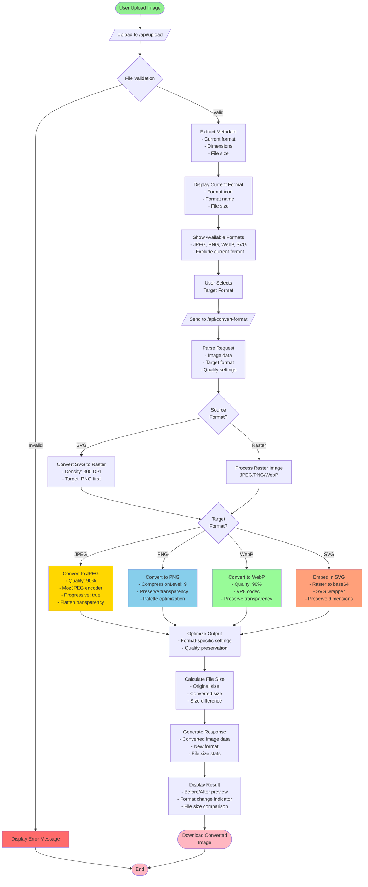

---

## Chain Operations Flow

Flow diagram showing how users can chain multiple operations across different modes.

```mermaid
flowchart TD
    Start([User Starts with Any Mode]) --> ProcessMode1[Process in Mode A<br/>e.g., Compression]

    ProcessMode1 --> Complete1[Processing Complete<br/>Display processed image]

    Complete1 --> UserAction1{User Choice}

    UserAction1 -->|Download| Download1([Download & End])
    UserAction1 -->|Edit Again| EditAgain1[Click "Edit Again" Button]

    EditAgain1 --> ConvertToFile[Convert Processed Image<br/>- base64 to Blob<br/>- Create File object<br/>- Preserve metadata]

    ConvertToFile --> StoreProcImg[Store Processed Image<br/>- Image data<br/>- Filename<br/>- MIME type]

    StoreProcImg --> ReturnToModes[Navigate to Mode Selection<br/>With processed image]

    ReturnToModes --> SelectMode2[User Selects Different Mode<br/>e.g., Rotate & Flip]

    SelectMode2 --> ProcessMode2[Process in Mode B<br/>Using previous output]

    ProcessMode2 --> Complete2[Processing Complete<br/>Display new result]

    Complete2 --> UserAction2{User Choice}

    UserAction2 -->|Download| Download2([Download & End])
    UserAction2 -->|Edit Again| EditAgain2[Click "Edit Again" Again]

    EditAgain2 --> ConvertToFile

    UserAction2 -->|Continue Chain| SelectMode3[Select Another Mode<br/>e.g., Enhancement]

    SelectMode3 --> ProcessMode3[Process in Mode C<br/>Further refinement]

    ProcessMode3 --> Complete3[Final Result]

    Complete3 --> UserAction3{User Choice}

    UserAction3 -->|Download| Download3([Download Final Result])
    UserAction3 -->|Edit Again| EditAgain3[Continue Chaining...]

    EditAgain3 --> ConvertToFile

    Download1 --> End([End])
    Download2 --> End
    Download3 --> End

    style Start fill:#90EE90
    style EditAgain1 fill:#FFD700
    style EditAgain2 fill:#FFD700
    style EditAgain3 fill:#FFD700
    style ConvertToFile fill:#87CEEB
    style Download1 fill:#FFB6C1
    style Download2 fill:#FFB6C1
    style Download3 fill:#FFB6C1
    style End fill:#FFB6C1
```

---

## Image Compression Flow

Flow diagram for iterative image compression with format-specific optimization and batch processing.


---

## Format-Specific Processing Flows

### SVG to Raster Conversion Flow

Detailed flow for converting SVG inputs to raster format across all modes.

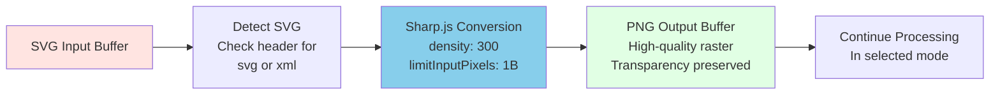

### JPEG Compression Algorithm

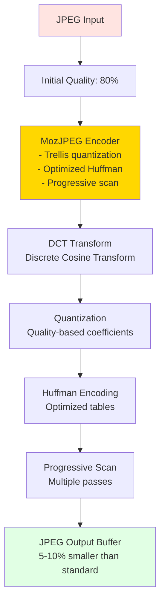

### PNG Compression Algorithm

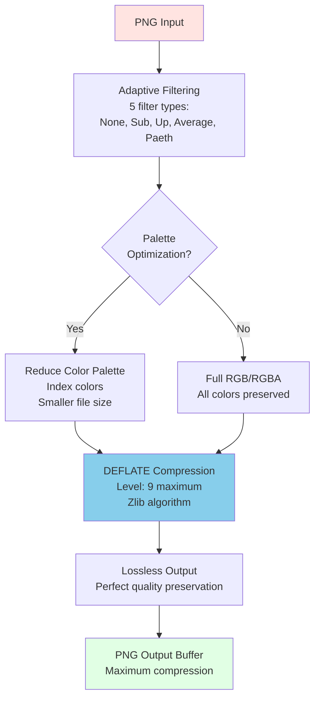

### WebP Compression Algorithm

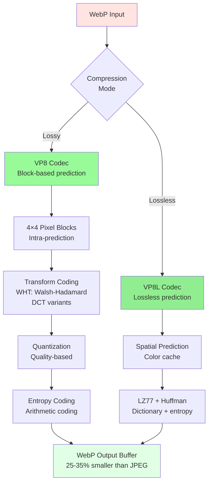

---

## Large Image Upload Flow

Detailed flow showing how large image payloads are handled with client-side compression and server-side parsing.

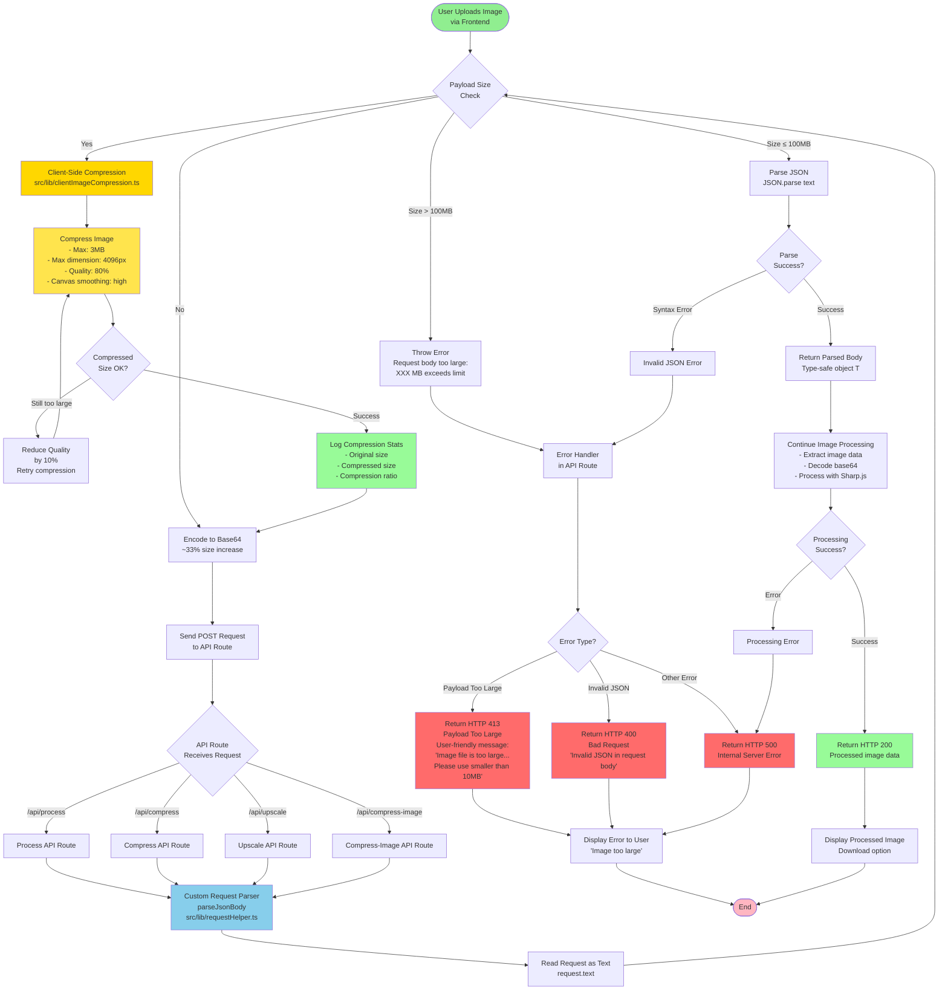

### Client-Side Compression Details

The application automatically compresses large images before upload to prevent payload size errors:

**When Compression Triggers**:
- File size > 3MB
- Automatic, transparent to user
- Logs compression stats to console

**Compression Settings**:
- **Max Size**: 3MB (ensures ~4MB after base64 encoding)
- **Max Dimension**: 4096px width/height
- **Quality**: 80% (high quality preserved)
- **Smoothing**: High-quality canvas smoothing enabled
- **Iterative**: Reduces quality by 10% if still too large

**Benefits**:
- ✅ Prevents "Request Entity Too Large" errors on all platforms
- ✅ Works with Vercel's 4.5MB payload limit
- ✅ Maintains image quality (80%+)
- ✅ Faster uploads (smaller files)
- ✅ No user intervention required

**Files Involved**:
- `src/lib/clientImageCompression.ts` - Compression utility
- `src/hooks/useFileUpload.ts` - Upload hook with compression
- `src/components/ImageUploader.tsx` - Visual feedback

### Large File Support by Processing Mode

The application's 5 processing modes have varying levels of compression support:

**Single Upload Compression** (via `useFileUpload` hook):
- ✅ **AI Image Resizing**: Fully supported
- ✅ **Manual Cropping**: Fully supported
- ✅ **Image Compression**: Fully supported
- ✅ **Image Enhancement**: Fully supported
- ✅ **Rotate & Flip**: Fully supported

**Batch Upload Compression** (via `batchUploadHelper`):
- ❌ **AI Image Resizing**: UI restricted to single image only (code supports batch internally)
- ❌ **Manual Cropping**: UI restricted to single image only (code supports batch internally)
- ✅ **Image Compression**: Fully supported with batch compression
- ✅ **Image Enhancement**: Fully supported with batch compression
- ✅ **Rotate & Flip**: Fully supported with batch compression

**Summary Table**:

| Processing Mode | Single Upload | Batch Upload | UI Availability | Implementation Status |
|----------------|--------------|--------------|----------------|----------------------|
| **AI Image Resizing** | ✅ Compressed (>3MB) | ⚠️ Code ready, UI restricted | Single only | UI Restriction |
| **Manual Cropping** | ✅ Compressed (>3MB) | ⚠️ Code ready, UI restricted | Single only | UI Restriction |
| **Image Compression** | ✅ Compressed (>3MB) | ✅ Compressed (>3MB) | Single & Batch | **Full Support** |
| **Image Enhancement** | ✅ Compressed (>3MB) | ✅ Compressed (>3MB) | Single & Batch | **Full Support** |
| **Rotate & Flip** | ✅ Compressed (>3MB) | ✅ Compressed (>3MB) | Single & Batch | **Full Support** |

**UI Batch Mode Restrictions** (page.tsx:310):
- When multiple files are uploaded, only modes in `batchCapableModes` array are shown
- Current restriction: `['compression', 'enhancement', 'rotate-flip']`
- AI Image Resizing and Manual Cropping have batch code but are excluded from UI
- Message shown: "Generative Expand and Manual Cropping are only available for single images"

**Implementation Details**:
- Single uploads use compression automatically through the `useFileUpload` hook
- Batch uploads in Image Compression, Enhancement, and Rotate & Flip modes use the `prepareFilesForBatchUpload()` helper
- All compression uses consistent settings: 3MB max, 4096px max dimension, 80% quality
- Chain operations allow seamless processing across all 5 modes

```

### Platform-Specific Payload Limits

Different deployment platforms have varying payload size limits. **With client-side compression**, all platforms work reliably:

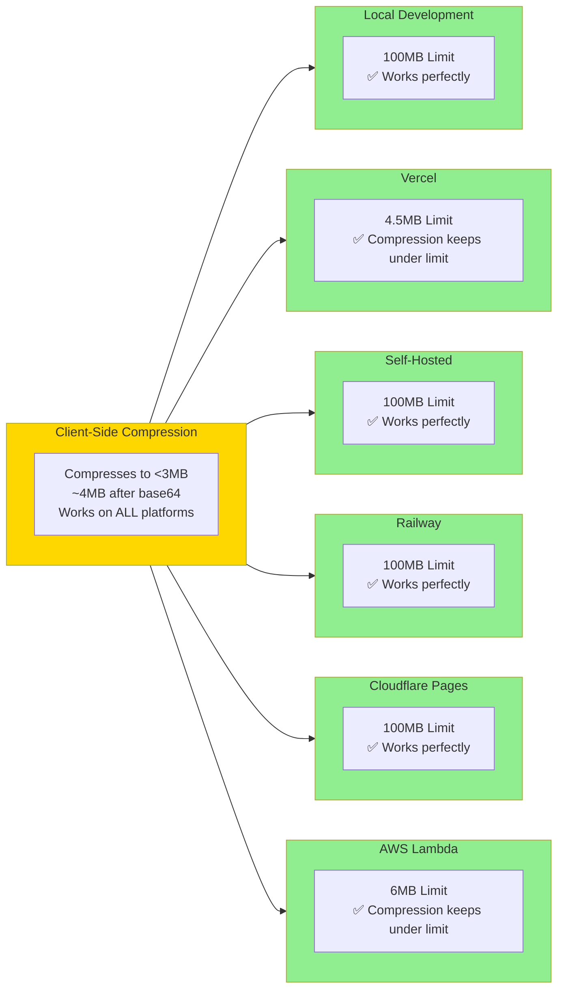

---

## Integration Flow

Complete end-to-end integration showing how all components work together.

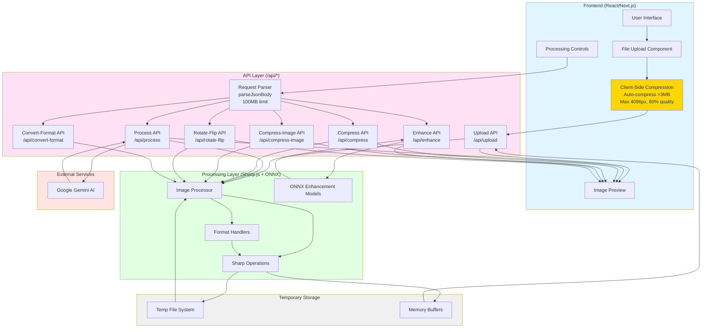

---

## Notes

### Viewing These Diagrams

To view these Mermaid diagrams:

1. **GitHub**: Automatically renders Mermaid in markdown files
2. **VS Code**: Install "Markdown Preview Mermaid Support" extension
3. **Online**: Use [Mermaid Live Editor](https://mermaid.live/)
4. **Documentation Sites**: Most modern documentation platforms support Mermaid

### Diagram Legend

- **Green nodes**: Start/End points
- **Pink nodes**: Download/Complete actions
- **Blue nodes**: Processing operations
- **Yellow nodes**: Format-specific operations
- **Red nodes**: Error states
- **Diamond shapes**: Decision points
- **Rectangles**: Processing steps
- **Rounded rectangles**: User actions