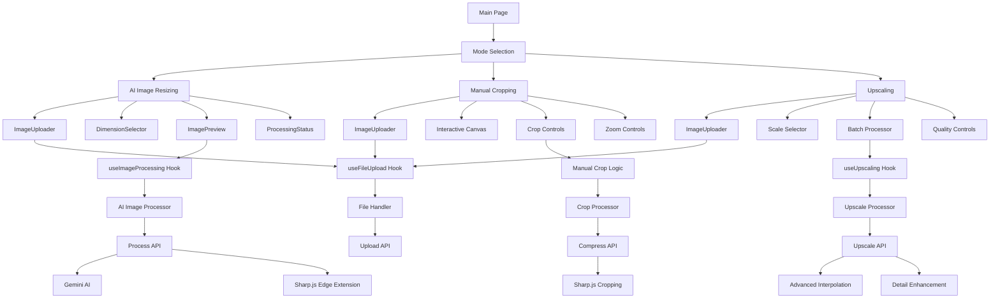

# AI Image Processing Suite

A comprehensive image processing platform offering three powerful modes: AI-powered smart resizing with canvas extension, precision manual cropping, and advanced upscaling. Built with Next.js 15, TypeScript, and Google's Gemini AI for intelligent image processing.

## 🌟 Features

### 🤖 AI Image Resizing
- **AI-Powered Canvas Extension**: Uses Google's Gemini 2.5 Flash Image model to intelligently extend image backgrounds
- **Smart Content-Aware Resizing**: Maintains subject positioning while extending canvas areas seamlessly
- **Edge Detection Fallback**: Automatic fallback to edge-extension algorithms when AI is unavailable
- **Multiple Aspect Ratios**: Pre-configured ratios including:
  - Instagram Stories/TikTok (9:16)
  - Portrait Print (2:3)
  - Widescreen (16:9)
  - Square (1:1)
  - Standard (4:3)
  - Landscape (3:2)
- **Custom Dimensions**: Support for any custom width and height
- **Real-time Preview**: Side-by-side comparison of original and processed images

### ✂️ Manual Cropping
- **Precision Control**: Drag-and-zoom functionality for pixel-perfect cropping
- **Interactive Canvas**: Click and drag image positioning within crop frame
- **Zoom Controls**: Scale images up or down for precise framing
- **Real-time Preview**: Live preview of crop area with exact dimensions
- **Frame Constraints**: Maintains aspect ratio while allowing flexible positioning
- **High-Quality Output**: Preserves image quality during cropping process

### 🔍 Upscaling
- **Quality Enhancement**: Advanced upscaling algorithms for resolution improvement
- **Scale Factor Control**: 2x, 3x, 4x scaling options or custom target resolutions
- **Batch Processing**: Support for processing multiple images simultaneously
- **Quality Preservation**: Maintains image clarity and detail during upscaling
- **Format Optimization**: Automatic format selection for best quality-to-size ratio

### 🎯 Universal Features
- **Drag & Drop Interface**: Intuitive file upload with comprehensive validation
- **Progress Tracking**: Real-time processing status with detailed progress indicators
- **Error Handling**: Graceful error handling with user-friendly messages
- **File Validation**: Automatic validation of file size (max 10MB) and supported formats
- **Responsive Design**: Works seamlessly across desktop and mobile devices
- **Instant Download**: One-click download of processed images
- **No Upload Limits**: Process images without restrictions
- **Multiple Format Support**: JPEG, PNG, WebP input and output

## 🛠 Technology Stack

### Frontend
- **Next.js 15**: React framework with App Router and Turbopack
- **TypeScript**: Full type safety throughout the application
- **Tailwind CSS 4**: Utility-first CSS framework for styling
- **shadcn/ui**: High-quality UI components built on Radix UI
- **Lucide React**: Beautiful, customizable icons

### Backend & Processing
- **Next.js API Routes**: Serverless API endpoints for all processing modes
- **Sharp.js**: High-performance image processing and manipulation
- **Formidable**: Multipart form data parsing for file uploads
- **Google Gemini AI**: Advanced AI model for intelligent image extension
- **Custom Processing Algorithms**: Edge detection and upscaling implementations

### UI Components & Libraries
- **Radix UI**: Accessible, unstyled UI primitives (Dialog, Progress, Select, Slider, Tabs)
- **React Dropzone**: File upload with drag & drop functionality
- **Class Variance Authority**: Utility for creating variant-based component APIs
- **clsx & tailwind-merge**: Conditional styling utilities
- **Lucide React**: Beautiful, customizable icons

## 🚀 Getting Started

### Prerequisites

- **Node.js 18+**: Download from [nodejs.org](https://nodejs.org/)
- **npm or yarn**: Package manager (npm comes with Node.js)
- **Google Gemini API key**: Get one from [Google AI Studio](https://aistudio.google.com/)

### Installation

1. **Clone the repository:**
```bash
git clone <repository-url>
cd ai-image-resizer
```

2. **Install dependencies:**
```bash
npm install
# or
yarn install
```

3. **Set up environment variables:**
```bash
# Copy the environment template (if available)
cp .env.example .env.local
# or create .env.local manually
```

4. **Configure your API key in `.env.local`:**
```env
GEMINI_API_KEY=your_gemini_api_key_here
```

5. **Start the development server:**
```bash
npm run dev
# or
yarn dev
```

6. **Open your browser:**
Navigate to [http://localhost:3000](http://localhost:3000) to use the application.

### Development Commands

```bash
# Start development server with Turbopack
npm run dev

# Build for production
npm run build

# Start production server
npm start

# Run linting
npm run lint
```

## 📖 Usage

### Processing Mode Selection

The application offers three distinct processing modes accessible from the main interface:

1. **AI Image Resizing** - For intelligent canvas extension and aspect ratio changes
2. **Manual Cropping** - For precise, hands-on image cropping
3. **Upscaling** - For resolution enhancement and quality improvement

### 🤖 AI Image Resizing Mode

1. **Upload Image**
   - Drag and drop an image file onto the upload area
   - Or click the upload area to browse and select a file
   - Supported formats: JPEG, PNG, WebP (max 10MB)
   - The application will validate and display image details

2. **Select Target Dimensions**
   - Choose from preset aspect ratios (Instagram Stories, Portrait, etc.)
   - Or enter custom width and height values
   - Preview shows how the image will be resized

3. **Process Image**
   - Click "Resize Image" to start processing
   - Watch real-time progress with status updates
   - AI will intelligently extend the canvas to match target dimensions

4. **Download Result**
   - Preview the before/after comparison
   - Click "Download" to save the processed image
   - View metadata including dimensions, format, and file size

### ✂️ Manual Cropping Mode

1. **Upload Image**
   - Upload your image using the drag-and-drop interface
   - Image appears on an interactive canvas

2. **Set Crop Dimensions**
   - Select from preset aspect ratios or enter custom dimensions
   - Crop frame appears on the canvas

3. **Position and Scale**
   - Drag the image to position it within the crop frame
   - Use zoom controls to scale the image up or down
   - Real-time preview shows exact crop area

4. **Export Crop**
   - Click "Crop Image" to process
   - Download the precisely cropped result

### 🔍 Upscaling Mode

1. **Upload Image**
   - Upload the image you want to enhance
   - View original dimensions and file information

2. **Choose Scale Factor**
   - Select 2x, 3x, or 4x scaling multiplier
   - Or specify exact target resolution
   - Preview estimated output size

3. **Process Enhancement**
   - Click "Upscale Image" to begin processing
   - Monitor progress with detailed status updates

4. **Download Enhanced Image**
   - Download the high-resolution result
   - Compare with original using side-by-side preview

### Processing Methods

The application uses multiple strategies across different modes:

**AI Image Resizing:**
1. **AI Extension (Primary)**: Uses Google Gemini 2.5 Flash Image model for intelligent background extension
2. **Edge Extension (Fallback)**: Extends edges when AI is unavailable or fails
3. **Smart Optimization**: Automatically optimizes output format and quality

**Manual Cropping:**
1. **Precision Algorithms**: High-quality cropping with Sharp.js
2. **Interactive Preview**: Real-time crop area visualization
3. **Quality Preservation**: Maintains original image quality

**Upscaling:**
1. **Advanced Interpolation**: High-quality scaling algorithms
2. **Edge Enhancement**: Preserves and enhances image details
3. **Format Optimization**: Optimal output format selection

## 🔌 API Endpoints

### POST `/api/upload`
Upload and validate image files for all processing modes.

**Request:**
- Content-Type: `multipart/form-data`
- Body: Form data with `file` field

**Response:**
```json
{
  "success": true,
  "data": {
    "filename": "image.jpg",
    "mimetype": "image/jpeg",
    "size": 1024000,
    "originalDimensions": {
      "width": 1920,
      "height": 1080
    },
    "imageData": "data:image/jpeg;base64,..."
  }
}
```

### POST `/api/process`
Process images with AI extension or fallback methods (AI Image Resizing mode).

**Request:**
```json
{
  "imageData": "data:image/jpeg;base64,...",
  "originalDimensions": {
    "width": 1920,
    "height": 1080
  },
  "targetDimensions": {
    "width": 1080,
    "height": 1920
  },
  "options": {
    "quality": 80,
    "format": "jpeg"
  }
}
```

**Response:**
```json
{
  "success": true,
  "data": {
    "imageData": "data:image/jpeg;base64,...",
    "metadata": {
      "width": 1080,
      "height": 1920,
      "format": "jpeg",
      "size": 987654
    },
    "fallbackUsed": false
  }
}
```

### POST `/api/compress`
Crop images with precise control (Manual Cropping mode).

**Request:**
```json
{
  "imageData": "data:image/jpeg;base64,...",
  "cropData": {
    "x": 100,
    "y": 100,
    "width": 800,
    "height": 600
  },
  "targetDimensions": {
    "width": 1080,
    "height": 1920
  },
  "options": {
    "quality": 80,
    "format": "jpeg"
  }
}
```

**Response:**
```json
{
  "success": true,
  "data": {
    "imageData": "data:image/jpeg;base64,...",
    "metadata": {
      "width": 1080,
      "height": 1920,
      "format": "jpeg",
      "size": 654321
    }
  }
}
```

### POST `/api/upscale`
Enhance and upscale images to higher resolutions (Upscaling mode).

**Request:**
```json
{
  "imageData": "data:image/jpeg;base64,...",
  "scaleFactor": 2,
  "targetDimensions": {
    "width": 3840,
    "height": 2160
  },
  "options": {
    "quality": 90,
    "format": "jpeg",
    "preserveAspectRatio": true
  }
}
```

**Response:**
```json
{
  "success": true,
  "data": {
    "imageData": "data:image/jpeg;base64,...",
    "metadata": {
      "width": 3840,
      "height": 2160,
      "format": "jpeg",
      "size": 2048000,
      "originalSize": 1024000,
      "scaleFactor": 2
    }
  }
}
```

## ⚙️ Configuration

### Environment Variables

| Variable | Required | Description | Default |
|----------|----------|-------------|---------|
| `GEMINI_API_KEY` | Yes | Your Google Gemini API key for AI features | - |

### Application Constants

- **Max File Size**: 10MB per file
- **Supported Input Formats**: JPEG, PNG, WebP
- **Supported Output Formats**: JPEG, PNG, WebP
- **Processing Timeout**: 60 seconds
- **Default Quality**: 80%
- **Upscaling Limits**: Up to 4x original resolution
- **Batch Processing**: Support for multiple files in upscaling mode

### Supported Aspect Ratios

| Ratio | Dimensions | Use Case |
|-------|------------|----------|
| 9:16 | 1080x1920 | Instagram Stories, TikTok |
| 2:3 | 1200x1800 | Portrait Print |
| 16:9 | 1920x1080 | Widescreen, YouTube |
| 1:1 | 1080x1080 | Instagram Posts |
| 4:3 | 1440x1080 | Standard Display |
| 3:2 | 1620x1080 | Landscape Photography |

### Processing Strategies

**AI Image Resizing:**
1. **AI Extension (Primary)**: Uses Gemini 2.5 Flash Image model for intelligent background extension
2. **Edge Extension (Fallback)**: Extends image edges when AI is unavailable
3. **Smart Optimization**: Automatically optimizes output format and quality for web use

**Manual Cropping:**
1. **Interactive Canvas**: Real-time drag-and-drop positioning with zoom controls
2. **Precision Algorithms**: High-quality cropping with Sharp.js processing
3. **Quality Preservation**: Maintains original image fidelity during crop operations

**Upscaling:**
1. **Advanced Interpolation**: Multi-algorithm approach for optimal quality
2. **Detail Enhancement**: Edge-preserving techniques for sharpness
3. **Batch Optimization**: Efficient processing for multiple images

## 🏗️ Architecture

### Project Structure

```
ai-image-resizer/
├── src/
│   ├── app/                    # Next.js App Router
│   │   ├── api/
│   │   │   ├── upload/        # File upload endpoint
│   │   │   ├── process/       # AI image resizing endpoint
│   │   │   ├── compress/      # Manual cropping endpoint
│   │   │   └── upscale/       # Image upscaling endpoint
│   │   ├── globals.css        # Global styles
│   │   ├── layout.tsx         # Root layout
│   │   └── page.tsx           # Main application page
│   ├── components/            # React components
│   │   ├── ui/               # shadcn/ui base components
│   │   │   ├── button.tsx
│   │   │   ├── card.tsx
│   │   │   ├── dialog.tsx
│   │   │   ├── input.tsx
│   │   │   ├── progress.tsx
│   │   │   ├── select.tsx
│   │   │   ├── slider.tsx
│   │   │   └── tabs.tsx
│   │   ├── modes/            # Processing mode components
│   │   │   ├── AIImageResizing.tsx  # AI-powered resizing mode
│   │   │   ├── ManualCropping.tsx   # Manual cropping mode
│   │   │   └── Upscaling.tsx        # Image upscaling mode
│   │   ├── ImageUploader.tsx  # File upload component
│   │   ├── DimensionSelector.tsx # Aspect ratio selector
│   │   ├── ImagePreview.tsx   # Before/after preview
│   │   └── ProcessingStatus.tsx # Progress indicator
│   ├── hooks/                 # Custom React hooks
│   │   ├── useFileUpload.ts   # File upload logic
│   │   ├── useImageProcessing.ts # Image processing logic
│   │   └── useUpscaling.ts    # Upscaling logic
│   ├── lib/                   # Utility libraries
│   │   ├── constants.ts       # App constants
│   │   ├── fileHandler.ts     # File handling utilities
│   │   ├── imageProcessor.ts  # Core image processing
│   │   ├── cloudConvert.ts    # Cloud processing utilities
│   │   └── utils.ts           # General utilities
│   └── types/                 # TypeScript definitions
│       └── index.ts           # Type definitions
├── public/                    # Static assets
├── components.json            # shadcn/ui config
├── next-env.d.ts             # Next.js type definitions
├── next.config.js            # Next.js configuration
├── package.json              # Dependencies and scripts
├── postcss.config.mjs        # PostCSS configuration
├── tailwind.config.js        # Tailwind CSS configuration
├── tsconfig.json             # TypeScript configuration
└── README.md                 # Project documentation
```

### Component Architecture



### Data Flow

#### AI Image Resizing Mode
1. **File Upload**: User uploads image → `useFileUpload` → `/api/upload` → File validation & metadata extraction
2. **Dimension Selection**: User selects target dimensions → State update → Preview update
3. **AI Processing**: User clicks process → `useImageProcessing` → `/api/process` → AI extension or edge fallback
4. **Download**: Processed image → Base64 to blob conversion → Browser download

#### Manual Cropping Mode
1. **File Upload**: User uploads image → `useFileUpload` → `/api/upload` → File validation & metadata extraction
2. **Interactive Positioning**: User drags image within crop frame → Real-time position updates
3. **Zoom & Scale**: User adjusts zoom → Image scale updates → Crop preview updates
4. **Crop Processing**: User clicks crop → Manual crop logic → `/api/compress` → Sharp.js cropping
5. **Download**: Cropped image → Base64 to blob conversion → Browser download

#### Upscaling Mode
1. **File Upload**: User uploads image → `useFileUpload` → `/api/upload` → File validation & metadata extraction
2. **Scale Selection**: User selects scale factor or target resolution → Preview size calculation
3. **Batch Processing**: User adds multiple files (optional) → Queue management
4. **Upscale Processing**: User clicks upscale → `useUpscaling` → `/api/upscale` → Advanced interpolation
5. **Download**: Enhanced image(s) → Base64 to blob conversion → Browser download

## 🚀 Deployment

### Build for Production

```bash
# Build the application
npm run build

# Start production server
npm start
```

### Environment Setup for Production

1. Set environment variables in your hosting platform
2. Ensure `GEMINI_API_KEY` is properly configured
3. Configure proper CORS settings if needed

### Recommended Hosting Platforms

- **Vercel**: Optimized for Next.js applications
- **Netlify**: Easy deployment with git integration
- **Railway**: Simple deployment with automatic HTTPS
- **AWS**: For enterprise-scale deployments

## 🔧 Development

### Adding New Features

1. **New Components**: Add to `src/components/`
2. **API Routes**: Add to `src/app/api/`
3. **Utilities**: Add to `src/lib/`
4. **Types**: Update `src/types/index.ts`

### Code Style

- TypeScript for type safety
- ESLint for code quality
- Tailwind CSS for styling
- shadcn/ui components for consistency

### Testing

```bash
# Run linting
npm run lint

# Type checking
npx tsc --noEmit
```

## 🐛 Troubleshooting

### Common Issues

1. **API Key Not Working (AI Image Resizing)**
   - Verify your Gemini API key is correct
   - Check the key has proper permissions
   - Ensure `.env.local` is in the root directory
   - AI mode will fallback to edge extension if API fails

2. **File Upload Fails**
   - Check file size is under 10MB
   - Verify file format is supported (JPEG, PNG, WebP)
   - Try a different image file
   - Ensure browser supports modern JavaScript features

3. **AI Processing Issues**
   - Large images may take longer to process
   - Check your internet connection
   - Fallback edge extension will be used if AI fails
   - Monitor processing status for detailed error messages

4. **Manual Cropping Problems**
   - Ensure image is properly loaded before attempting to crop
   - Check that crop frame is within image boundaries
   - Verify target dimensions are reasonable
   - Clear browser cache if canvas rendering issues occur

5. **Upscaling Limitations**
   - Very large upscale factors (>4x) may fail or take excessive time
   - Check available system memory for large image processing
   - Consider reducing image size before upscaling
   - Use batch processing for multiple smaller images rather than one very large image

6. **Build Errors**
   - Run `npm install` to ensure all dependencies are installed
   - Check Node.js version (requires 18+)
   - Clear `.next` folder and rebuild
   - Verify TypeScript configuration is correct

7. **Sharp Module Loading Error**
   - Run `npm install --include=optional sharp`
   - Rebuild Sharp: `npm rebuild sharp`
   - For platform-specific issues, try: `npm install --os=win32 --cpu=x64 sharp`
   - Check system architecture compatibility

8. **Performance Issues**
   - Large images may cause browser memory issues
   - Consider resizing images before processing
   - Close other browser tabs to free memory
   - Use smaller batch sizes for upscaling operations

### Mode-Specific Tips

**AI Image Resizing:**
- Works best with images that have clear subjects and backgrounds
- Fallback mode provides reliable results when AI is unavailable
- Complex or abstract images may benefit from manual cropping instead

**Manual Cropping:**
- Use zoom controls for precise positioning
- Drag from the center of the image for better control
- Preview updates in real-time to show exact crop area

**Upscaling:**
- Start with smaller scale factors (2x) for best results
- Higher quality settings may significantly increase processing time
- Batch processing works best with images of similar sizes

## 📝 License

This project is private and proprietary. All rights reserved.

---

**Note**: This comprehensive image processing suite offers three distinct modes:
- **AI Image Resizing** requires a Google Gemini API key for AI-powered features (fallback methods available)
- **Manual Cropping** works entirely offline with no external dependencies
- **Upscaling** uses advanced local algorithms for quality enhancement

Choose the mode that best fits your workflow and requirements!
