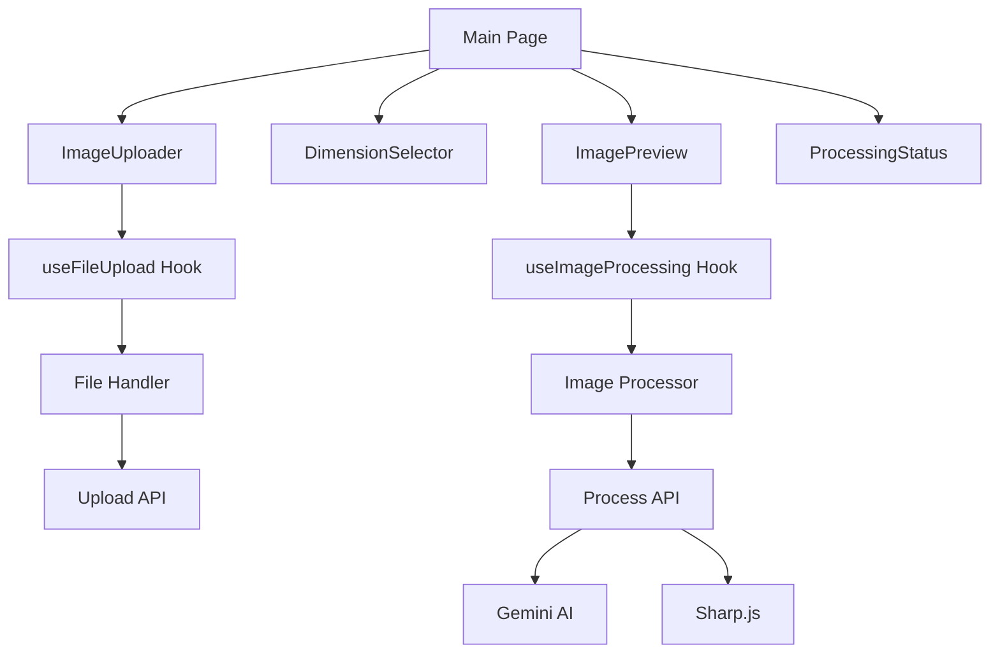

# AI-Powered Image Resizer

An intelligent image resizing and optimization tool that uses AI-powered canvas extension to create natural-looking results when extending images beyond their original dimensions. Perfect for content creators, social media managers, and anyone needing to adapt images to different aspect ratios while maintaining visual quality.

## 🌟 Features

### Core Functionality
- **AI-Powered Canvas Extension**: Uses Google's Gemini 2.5 Flash Image model to intelligently extend image backgrounds
- **Smart Resizing**: Maintains subject positioning while extending canvas areas seamlessly
- **Multiple Aspect Ratios**: Pre-configured ratios including:
  - Instagram Stories/TikTok (9:16)
  - Portrait Print (2:3)
  - Widescreen (16:9)
  - Square (1:1)
  - Standard (4:3)
  - Landscape (3:2)
- **Custom Dimensions**: Support for any custom width and height
- **Fallback Strategies**: Automatic fallback to edge-extension when AI is unavailable
- **Web Optimization**: Outputs web-optimized images in JPEG, PNG, or WebP formats
- **Real-time Preview**: Side-by-side comparison of original and processed images
- **Drag & Drop Interface**: Intuitive file upload with comprehensive validation

### User Experience
- **Progress Tracking**: Real-time processing status with detailed progress indicators
- **Error Handling**: Graceful error handling with user-friendly messages
- **File Validation**: Automatic validation of file size (max 10MB) and supported formats
- **Responsive Design**: Works seamlessly across desktop and mobile devices
- **Instant Download**: One-click download of processed images

## 🛠 Technology Stack

### Frontend
- **Next.js 15**: React framework with App Router and Turbopack
- **TypeScript**: Full type safety throughout the application
- **Tailwind CSS 4**: Utility-first CSS framework for styling
- **shadcn/ui**: High-quality UI components built on Radix UI
- **Lucide React**: Beautiful, customizable icons

### Backend & Processing
- **Next.js API Routes**: Serverless API endpoints
- **Sharp.js**: High-performance image processing
- **Formidable**: Multipart form data parsing for file uploads
- **Google Gemini AI**: Advanced AI model for intelligent image extension

### UI Components & Libraries
- **Radix UI**: Accessible, unstyled UI primitives
- **React Dropzone**: File upload with drag & drop functionality
- **Class Variance Authority**: Utility for creating variant-based component APIs
- **clsx & tailwind-merge**: Conditional styling utilities

## 🚀 Getting Started

### Prerequisites

- **Node.js 18+**: Download from [nodejs.org](https://nodejs.org/)
- **npm or yarn**: Package manager (npm comes with Node.js)
- **Google Gemini API key**: Get one from [Google AI Studio](https://aistudio.google.com/)

### Installation

1. **Clone the repository:**
```bash
git clone <repository-url>
cd ai-image-resizer
```

2. **Install dependencies:**
```bash
npm install
# or
yarn install
```

3. **Set up environment variables:**
```bash
# Copy the environment template (if available)
cp .env.example .env.local
# or create .env.local manually
```

4. **Configure your API key in `.env.local`:**
```env
GEMINI_API_KEY=your_gemini_api_key_here
```

5. **Start the development server:**
```bash
npm run dev
# or
yarn dev
```

6. **Open your browser:**
Navigate to [http://localhost:3000](http://localhost:3000) to use the application.

### Development Commands

```bash
# Start development server with Turbopack
npm run dev

# Build for production
npm run build

# Start production server
npm start

# Run linting
npm run lint
```

## 📖 Usage

### Step-by-Step Guide

1. **Upload Image**
   - Drag and drop an image file onto the upload area
   - Or click the upload area to browse and select a file
   - Supported formats: JPEG, PNG, WebP (max 10MB)
   - The application will validate and display image details

2. **Select Target Dimensions**
   - Choose from preset aspect ratios (Instagram Stories, Portrait, etc.)
   - Or enter custom width and height values
   - Preview shows how the image will be resized

3. **Process Image**
   - Click "Resize Image" to start processing
   - Watch real-time progress with status updates
   - AI will intelligently extend the canvas to match target dimensions

4. **Download Result**
   - Preview the before/after comparison
   - Click "Download" to save the processed image
   - View metadata including dimensions, format, and file size

### Processing Methods

The application uses multiple strategies to ensure the best results:

1. **AI Extension (Primary)**: Uses Google Gemini 2.5 Flash Image model for intelligent background extension
2. **Edge Extension (Fallback)**: Extends edges when AI is unavailable or fails
3. **Smart Optimization**: Automatically optimizes output format and quality

## 🔌 API Endpoints

### POST `/api/upload`
Upload and validate image files.

**Request:**
- Content-Type: `multipart/form-data`
- Body: Form data with `file` field

**Response:**
```json
{
  "success": true,
  "data": {
    "filename": "image.jpg",
    "mimetype": "image/jpeg",
    "size": 1024000,
    "originalDimensions": {
      "width": 1920,
      "height": 1080
    },
    "imageData": "data:image/jpeg;base64,..."
  }
}
```

### POST `/api/process`
Process images with AI extension or fallback methods.

**Request:**
```json
{
  "imageData": "data:image/jpeg;base64,...",
  "originalDimensions": {
    "width": 1920,
    "height": 1080
  },
  "targetDimensions": {
    "width": 1080,
    "height": 1920
  },
  "options": {
    "quality": 80,
    "format": "jpeg"
  }
}
```

**Response:**
```json
{
  "success": true,
  "data": {
    "imageData": "data:image/jpeg;base64,...",
    "metadata": {
      "width": 1080,
      "height": 1920,
      "format": "jpeg",
      "size": 987654
    },
    "fallbackUsed": false
  }
}
```

## ⚙️ Configuration

### Environment Variables

| Variable | Required | Description | Default |
|----------|----------|-------------|---------|
| `GEMINI_API_KEY` | Yes | Your Google Gemini API key for AI features | - |

### Application Constants

- **Max File Size**: 10MB
- **Supported Input Formats**: JPEG, PNG, WebP
- **Supported Output Formats**: JPEG, PNG, WebP
- **Processing Timeout**: 30 seconds
- **Default Quality**: 80%

### Supported Aspect Ratios

| Ratio | Dimensions | Use Case |
|-------|------------|----------|
| 9:16 | 1080x1920 | Instagram Stories, TikTok |
| 2:3 | 1200x1800 | Portrait Print |
| 16:9 | 1920x1080 | Widescreen, YouTube |
| 1:1 | 1080x1080 | Instagram Posts |
| 4:3 | 1440x1080 | Standard Display |
| 3:2 | 1620x1080 | Landscape Photography |

### Processing Strategies

1. **AI Extension (Primary)**: Uses Gemini 2.5 Flash Image model for intelligent background extension
2. **Edge Extension (Fallback)**: Extends image edges when AI is unavailable
3. **Smart Optimization**: Automatically optimizes output format and quality for web use

## 🏗️ Architecture

### Project Structure

```
ai-image-resizer/
├── src/
│   ├── app/                    # Next.js App Router
│   │   ├── api/
│   │   │   ├── upload/        # File upload endpoint
│   │   │   └── process/       # Image processing endpoint
│   │   ├── globals.css        # Global styles
│   │   ├── layout.tsx         # Root layout
│   │   └── page.tsx           # Main application page
│   ├── components/            # React components
│   │   ├── ui/               # shadcn/ui base components
│   │   │   ├── button.tsx
│   │   │   ├── card.tsx
│   │   │   ├── dialog.tsx
│   │   │   ├── input.tsx
│   │   │   ├── progress.tsx
│   │   │   ├── select.tsx
│   │   │   └── tabs.tsx
│   │   ├── ImageUploader.tsx  # File upload component
│   │   ├── DimensionSelector.tsx # Aspect ratio selector
│   │   ├── ImagePreview.tsx   # Before/after preview
│   │   └── ProcessingStatus.tsx # Progress indicator
│   ├── hooks/                 # Custom React hooks
│   │   ├── useFileUpload.ts   # File upload logic
│   │   └── useImageProcessing.ts # Image processing logic
│   ├── lib/                   # Utility libraries
│   │   ├── constants.ts       # App constants
│   │   ├── fileHandler.ts     # File handling utilities
│   │   ├── imageProcessor.ts  # Core image processing
│   │   └── utils.ts           # General utilities
│   └── types/                 # TypeScript definitions
│       └── index.ts           # Type definitions
├── public/                    # Static assets
├── components.json            # shadcn/ui config
├── next-env.d.ts             # Next.js type definitions
├── next.config.js            # Next.js configuration
├── package.json              # Dependencies and scripts
├── postcss.config.mjs        # PostCSS configuration
├── tailwind.config.js        # Tailwind CSS configuration
├── tsconfig.json             # TypeScript configuration
└── README.md                 # Project documentation
```

### Component Architecture



### Data Flow

1. **File Upload**: User uploads image → `useFileUpload` → `/api/upload` → File validation & metadata extraction
2. **Dimension Selection**: User selects target dimensions → State update → Preview update
3. **Processing**: User clicks process → `useImageProcessing` → `/api/process` → AI extension or fallback
4. **Download**: Processed image → Base64 to blob conversion → Browser download

## 🚀 Deployment

### Build for Production

```bash
# Build the application
npm run build

# Start production server
npm start
```

### Environment Setup for Production

1. Set environment variables in your hosting platform
2. Ensure `GEMINI_API_KEY` is properly configured
3. Configure proper CORS settings if needed

### Recommended Hosting Platforms

- **Vercel**: Optimized for Next.js applications
- **Netlify**: Easy deployment with git integration
- **Railway**: Simple deployment with automatic HTTPS
- **AWS**: For enterprise-scale deployments

## 🔧 Development

### Adding New Features

1. **New Components**: Add to `src/components/`
2. **API Routes**: Add to `src/app/api/`
3. **Utilities**: Add to `src/lib/`
4. **Types**: Update `src/types/index.ts`

### Code Style

- TypeScript for type safety
- ESLint for code quality
- Tailwind CSS for styling
- shadcn/ui components for consistency

### Testing

```bash
# Run linting
npm run lint

# Type checking
npx tsc --noEmit
```

## 🐛 Troubleshooting

### Common Issues

1. **API Key Not Working**
   - Verify your Gemini API key is correct
   - Check the key has proper permissions
   - Ensure `.env.local` is in the root directory

2. **File Upload Fails**
   - Check file size is under 10MB
   - Verify file format is supported (JPEG, PNG, WebP)
   - Try a different image file

3. **Processing Takes Too Long**
   - Large images may take longer to process
   - Check your internet connection
   - Fallback methods will be used if AI fails

4. **Build Errors**
   - Run `npm install` to ensure all dependencies are installed
   - Check Node.js version (requires 18+)
   - Clear `.next` folder and rebuild

5. **Sharp Module Loading Error**
   - Run `npm install --include=optional sharp`
   - Rebuild Sharp: `npm rebuild sharp`
   - For platform-specific issues, try: `npm install --os=win32 --cpu=x64 sharp`

## 📝 License

This project is private and proprietary. All rights reserved.

---

**Note**: This application requires a Google Gemini API key for AI-powered features. Fallback methods will be used if the API is unavailable.
