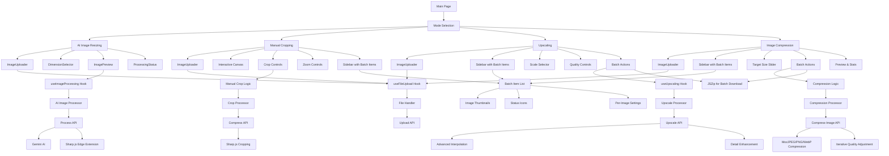

# AI Image Processing Suite

A comprehensive image processing platform offering four powerful modes: AI-powered smart resizing with canvas extension, precision manual cropping, advanced upscaling, and intelligent image compression. Built with Next.js 15, TypeScript, and Google's Gemini AI for intelligent image processing.

## 🌟 Features

### 🤖 AI Image Resizing
- **AI-Powered Canvas Extension**: Uses Google's Gemini 2.5 Flash Image model to intelligently extend image backgrounds
- **Smart Content-Aware Resizing**: Maintains subject positioning while extending canvas areas seamlessly
- **Edge Detection Fallback**: Automatic fallback to edge-extension algorithms when AI is unavailable
- **Multiple Aspect Ratios**: Pre-configured ratios including:
  - Instagram Stories/TikTok (9:16)
  - Portrait Print (2:3)
  - Widescreen (16:9)
  - Square (1:1)
  - Standard (4:3)
  - Landscape (3:2)
- **Custom Dimensions**: Support for any custom width and height
- **Real-time Preview**: Side-by-side comparison of original and processed images

### ✂️ Manual Cropping
- **Precision Control**: Drag-and-zoom functionality for pixel-perfect cropping
- **Interactive Canvas**: Click and drag image positioning within crop frame
- **Zoom Controls**: Scale images up or down for precise framing
- **Batch Support**: Process multiple images with sidebar UI showing all uploads
- **Per-Image Settings**: Customize crop dimensions and positioning for each image
- **Status Tracking**: Real-time status indicators (pending, processing, completed, error) for each image
- **Bulk Download**: Download all cropped images as a ZIP file or individually
- **Real-time Preview**: Live preview of crop area with exact dimensions
- **Frame Constraints**: Maintains aspect ratio while allowing flexible positioning
- **High-Quality Output**: Preserves image quality during cropping process

### 🔍 Upscaling
- **Quality Enhancement**: Advanced upscaling algorithms for resolution improvement
- **Scale Factor Control**: 1.1x to 4x scaling options or custom target resolutions
- **Upscaling Only**: Constrained to only enlarge images, not reduce size
- **Minimum Constraints**: Target resolution cannot be smaller than original
- **Batch Processing**: Support for processing multiple images simultaneously with sidebar UI
- **Per-Image Settings**: Customize scale factor, target resolution, and quality for each image individually
- **Batch Actions**: Process all images at once with default settings or customize each one
- **Status Tracking**: Real-time status indicators (pending, processing, completed, error) for each image
- **Bulk Download**: Download all processed images as a ZIP file or individually
- **Quality Preservation**: Maintains image clarity and detail during upscaling
- **Format Optimization**: Automatic format selection for best quality-to-size ratio

### 📦 Image Compression
- **Smart File Size Reduction**: Reduce image file sizes by up to 90% while maintaining visual quality
- **Auto-Optimized Quality**: Starts with optimal quality settings (80% for JPEG/WebP, level 9 for PNG)
- **Iterative Compression**: Automatically adjusts quality to reach target file size
- **Target Size Control**: Set maximum file size as percentage of original (10-100%)
- **Batch Processing**: Process multiple images simultaneously with sidebar UI
- **Per-Image Settings**: Customize target file size percentage for each image individually
- **Batch Actions**: Compress all images at once with default settings or customize each one
- **Status Tracking**: Real-time status indicators (pending, processing, completed, error) for each image
- **Bulk Download**: Download all compressed images as a ZIP file or individually
- **Format-Specific Optimization**:
  - JPEG: MozJPEG with progressive encoding for superior compression
  - PNG: Compression level 9 with palette optimization
  - WebP: Advanced WebP compression algorithms (80% quality)
- **Real-time Preview**: Live preview with before/after comparison
- **Compression Statistics**: Detailed metrics showing original, compressed, and target file sizes
- **Multi-attempt Algorithm**: Up to 10 compression attempts to achieve optimal results
- **Interactive Controls**: Mouse wheel scroll support on sliders for precise adjustments

### 🎯 Universal Features
- **Drag & Drop Interface**: Intuitive file upload with comprehensive validation
- **Progress Tracking**: Real-time processing status with detailed progress indicators
- **Error Handling**: Graceful error handling with user-friendly messages
- **File Validation**: Automatic validation of file size (max 10MB) and supported formats
- **Responsive Design**: Works seamlessly across desktop and mobile devices
- **Instant Download**: One-click download of processed images
- **No Upload Limits**: Process images without restrictions
- **Multiple Format Support**: JPEG, PNG, WebP input and output

### 🎨 UI/UX Enhancements
- **Interactive Sliders**: Mouse wheel scroll support on all sliders for precise control
  - Hover over any slider and scroll to adjust values
  - Prevents page scrolling when adjusting slider values
  - Smooth incremental adjustments based on slider type
- **Side-by-Side Preview**: Clean comparison layout for before/after images
  - Original Image vs Processed Result
  - Clear dimension labels
  - Professional card-based layout
- **Real-time Feedback**: Live updates of target sizes and compression percentages
- **Keyboard Shortcuts** (Manual Cropping):
  - Arrow keys: Move crop frame
  - Space: Apply crop
  - Ctrl+R: Reset

## 🧮 Processing Algorithms

### AI Image Resizing Algorithms

#### Primary Method: AI-Powered Extension
- **Model**: Google Gemini 2.5 Flash Image Preview
- **Technique**: Generative AI background extension
- **Process**:
  1. Sends original image with target dimensions to Gemini AI
  2. AI model analyzes image content, style, colors, lighting, and textures
  3. Generates seamless background extension matching original image characteristics
  4. Validates output against target dimensions
  5. Crops to exact dimensions if needed using center-crop algorithm

#### Fallback Method: Edge Color Detection
- **Library**: Sharp.js
- **Algorithm**: Statistical edge sampling with weighted averaging
- **Process**:
  1. **Edge Sampling**: Extracts pixel data from all four edges (top, bottom, left, right)
     - Edge thickness: 3% of smallest dimension (min 3px, max 15px)
     - Samples full width/height of each edge
  2. **Color Analysis**: Calculates mean RGB values for each edge using Sharp.js `.stats()` method
  3. **Weighted Averaging**:
     - Top and bottom edges: 1.5x weight (more representative)
     - Left and right edges: 1.0x weight
     - Formula: `RGB = Σ(edge_color × weight) / total_weight`
  4. **Canvas Creation**: Creates new canvas with detected background color
  5. **Image Compositing**: Centers original image on canvas using Sharp.js `.composite()`
  6. **Final Resize**: Ensures exact target dimensions with `.resize(fit: 'fill')`

### Manual Cropping Algorithm

- **Library**: Sharp.js
- **Method**: High-precision region extraction
- **Process**:
  1. **Scale Calculation**: Determines optimal scale to cover target area
     - `scale = max(targetWidth/originalWidth, targetHeight/originalHeight)`
  2. **Resize**: Scales image using calculated factor
  3. **Extract**: Uses Sharp.js `.extract()` method for pixel-perfect cropping
     - Calculates center position: `(scaledDimension - targetDimension) / 2`
     - Extracts exact region with specified x, y, width, height
  4. **Quality Preservation**: Maintains high quality (85-90%) during crop operation

### Upscaling Algorithm

- **Library**: Sharp.js
- **Resampling Kernel**: Lanczos3
- **Method**: High-quality interpolation-based upscaling
- **Process**:
  1. **Validation**: Ensures target dimensions ≥ original dimensions
  2. **Lanczos3 Resampling**:
     - Uses 3-lobe Lanczos windowed sinc filter
     - Kernel size: 6×6 pixel neighborhood
     - Provides superior edge preservation and sharpness
     - Optimal for photographic content and detail retention
  3. **Progressive Encoding**:
     - JPEG: Progressive scan encoding for web optimization
     - Multiple scan passes for faster perceived loading
  4. **Format Optimization**:
     - JPEG: Progressive encoding with configurable quality
     - PNG: Lossless with quality settings
     - WebP: Modern compression with quality control

**Algorithm Characteristics**:
- **Type**: Bicubic interpolation with windowed sinc function
- **Quality**: Superior to bilinear/bicubic for upscaling
- **Edge Handling**: Excellent sharpness preservation
- **Performance**: Optimized C++ implementation via Sharp.js

### Image Compression Algorithms

- **Library**: Sharp.js
- **Strategy**: Iterative quality reduction with format-specific optimization

#### Compression Process
1. **Initial Compression**:
   - Starting quality: 80% (JPEG/WebP) or level 9 (PNG)
   - Format-specific encoder selection
2. **Iterative Optimization**:
   - Compares output size to target size
   - If size > target: reduces quality by 10% and recompresses
   - Maximum attempts: 10 iterations
   - Minimum quality threshold: 10%
3. **Algorithm**: Binary search-like approach with fixed decrements
   - `quality_n = max(10, quality_{n-1} - 10)`
   - Stops when: `outputSize ≤ targetSize` OR `quality ≤ 10` OR `attempts ≥ 10`

#### Format-Specific Algorithms

**JPEG Compression:**
- **Encoder**: MozJPEG
- **Method**: Optimized JPEG encoding with trellis quantization
- **Features**:
  - Progressive scan encoding for better web loading
  - Optimized Huffman tables
  - Trellis quantization for better quality/size ratio
- **Settings**: Quality 10-80, progressive: true

**PNG Compression:**
- **Method**: DEFLATE compression with palette optimization
- **Settings**:
  - Compression level: 9 (maximum)
  - Palette: true (enables palette optimization for smaller file sizes)
- **Algorithm**: Lossless compression with optimal filtering
- **Note**: Quality parameter affects filtering, not lossy compression

**WebP Compression:**
- **Method**: VP8/VP8L compression
- **Type**: Lossy compression (for quality < 100)
- **Settings**: Quality 10-80
- **Algorithm**: Block-based prediction with transform coding
- **Advantages**: Better compression than JPEG at equivalent quality

## 🛠 Technology Stack

### Frontend
- **Next.js 15**: React framework with App Router and Turbopack
- **TypeScript**: Full type safety throughout the application
- **Tailwind CSS 4**: Utility-first CSS framework for styling
- **shadcn/ui**: High-quality UI components built on Radix UI
- **Lucide React**: Beautiful, customizable icons

### Backend & Processing
- **Next.js API Routes**: Serverless API endpoints for all processing modes
- **Sharp.js**: High-performance image processing library (libvips-based)
- **Formidable**: Multipart form data parsing for file uploads
- **Google Gemini AI**: Gemini 2.5 Flash Image model for intelligent canvas extension
- **Custom Processing Algorithms**: Edge detection, color sampling, and iterative compression

### UI Components & Libraries
- **Radix UI**: Accessible, unstyled UI primitives (Dialog, Progress, Select, Slider, Tabs)
- **React Dropzone**: File upload with drag & drop functionality
- **JSZip**: Client-side ZIP file generation for batch downloads
- **Class Variance Authority**: Utility for creating variant-based component APIs
- **clsx & tailwind-merge**: Conditional styling utilities
- **Lucide React**: Beautiful, customizable icons

## 🚀 Getting Started

### Prerequisites

- **Node.js 18+**: Download from [nodejs.org](https://nodejs.org/)
- **npm or yarn**: Package manager (npm comes with Node.js)
- **Google Gemini API key**: Get one from [Google AI Studio](https://aistudio.google.com/)

### Installation

1. **Clone the repository:**
```bash
git clone <repository-url>
cd ai-image-resizer
```

2. **Install dependencies:**
```bash
npm install
# or
yarn install
```

3. **Set up environment variables:**
```bash
# Copy the environment template (if available)
cp .env.example .env.local
# or create .env.local manually
```

4. **Configure your API key in `.env.local`:**
```env
GEMINI_API_KEY=your_gemini_api_key_here
```

5. **Start the development server:**
```bash
npm run dev
# or
yarn dev
```

6. **Open your browser:**
Navigate to [http://localhost:3000](http://localhost:3000) to use the application.

### Development Commands

```bash
# Start development server with Turbopack
npm run dev

# Build for production
npm run build

# Start production server
npm start

# Run linting
npm run lint
```

## 📖 Usage

### Processing Mode Selection

The application offers four distinct processing modes accessible from the main interface:

1. **AI Image Resizing** - For intelligent canvas extension and aspect ratio changes
2. **Manual Cropping** - For precise, hands-on image cropping
3. **Upscaling** - For resolution enhancement and quality improvement
4. **Image Compression** - For file size optimization and web-ready images

### 🤖 AI Image Resizing Mode

1. **Upload Image**
   - Drag and drop an image file onto the upload area
   - Or click the upload area to browse and select a file
   - Supported formats: JPEG, PNG, WebP (max 10MB)
   - The application will validate and display image details

2. **Select Target Dimensions**
   - Choose from preset aspect ratios (Instagram Stories, Portrait, etc.)
   - Or enter custom width and height values
   - Preview shows how the image will be resized

3. **Process Image**
   - Click "Resize Image" to start processing
   - Watch real-time progress with status updates
   - AI will intelligently extend the canvas to match target dimensions

4. **Download Result**
   - Preview the before/after comparison
   - Click "Download" to save the processed image
   - View metadata including dimensions, format, and file size

### ✂️ Manual Cropping Mode

1. **Upload Image(s)**
   - Upload single or multiple images using the drag-and-drop interface
   - Images appear in the sidebar with thumbnails and status indicators

2. **Select Image to Crop**
   - Click on an image from the sidebar to work on it
   - Selected image appears on the interactive canvas in the main content area

3. **Set Crop Dimensions**
   - Select from preset aspect ratios or enter custom dimensions
   - Crop frame appears on the canvas

4. **Position and Scale**
   - Drag the image to position it within the crop frame
   - Use zoom controls to scale the image up or down
   - Real-time preview shows exact crop area

5. **Process Images**
   - Click "Crop This Image" to process the selected image
   - Or click "Crop All Images" to process all pending images with their respective settings

6. **Export Results**
   - Download individual cropped images one by one
   - Or click "Download All" to get a ZIP file of all completed images

### 🔍 Upscaling Mode

1. **Upload Image(s)**
   - Upload single or multiple images you want to enhance
   - Images appear in the sidebar with thumbnails, dimensions, and file information

2. **Select Image for Customization (Optional)**
   - Click on an image from the sidebar to customize its settings
   - Selected image's settings appear in the main content area

3. **Choose Scale Factor**
   - Select 1.1x to 4x scaling multiplier
   - Or specify exact target resolution (minimum: original dimensions)
   - Adjust quality settings with mouse wheel scroll support
   - Settings can be customized per-image or use defaults

4. **Process Enhancement**
   - Click "Upscale This Image" to process the selected image with custom settings
   - Or click "Upscale All Images" to begin batch processing with default settings
   - Monitor progress with detailed status updates in the sidebar

5. **Download Enhanced Images**
   - Download individual high-resolution images as they complete
   - Or click "Download All" to get a ZIP file of all completed images
   - Compare with original using side-by-side preview for selected image

### 📦 Image Compression Mode

1. **Upload Image(s)**
   - Upload single or multiple images using drag-and-drop or file selection
   - Images appear in the sidebar with thumbnails, file sizes, and dimensions

2. **Select Image for Customization (Optional)**
   - Click on an image from the sidebar to customize its compression settings
   - Selected image's settings appear in the main content area

3. **Configure Compression Settings**
   - **Target File Size**: Set target size as percentage of original (10-100%)
   - Use slider or mouse wheel scroll for precise adjustment
   - Preview estimated target file size and reduction percentage
   - Settings can be customized per-image or use default (40%)

4. **Apply Compression**
   - Click "Compress This Image" to compress the selected image with custom settings
   - Or click "Compress All Images" to start batch processing with default settings
   - Algorithm starts with optimal quality (80% JPEG/WebP, level 9 PNG)
   - Automatically reduces quality by 10% increments if needed
   - Multiple optimization attempts ensure best quality-to-size ratio
   - Monitor progress with status updates in the sidebar

5. **Download Optimized Images**
   - Preview compressed image with statistics for selected image
   - View original, compressed, and target file sizes
   - Download individual compressed images as they complete
   - Or click "Download All" to get a ZIP file of all compressed images

### Processing Methods

The application uses multiple strategies across different modes:

**AI Image Resizing:**
1. **AI Extension (Primary)**: Uses Google Gemini 2.5 Flash Image model for intelligent background extension
2. **Edge Extension (Fallback)**: Extends edges when AI is unavailable or fails
3. **Smart Optimization**: Automatically optimizes output format and quality

**Manual Cropping:**
1. **Precision Algorithms**: High-quality cropping with Sharp.js
2. **Interactive Preview**: Real-time crop area visualization
3. **Quality Preservation**: Maintains original image quality

**Upscaling:**
1. **Advanced Interpolation**: High-quality scaling algorithms
2. **Edge Enhancement**: Preserves and enhances image details
3. **Format Optimization**: Optimal output format selection

**Image Compression:**
1. **Iterative Quality Adjustment**: Automatically reduces quality in 10% steps to reach target size
2. **Format-Specific Compression**:
   - JPEG: MozJPEG with optimized quality settings
   - PNG: Level 9 compression with maximum effort (effort: 10)
   - WebP: Advanced WebP compression algorithms
3. **Multi-Attempt Optimization**: Up to 10 compression attempts, minimum quality threshold of 10%
4. **Smart Size Targeting**: Precise file size control while maintaining visual quality

## 🔌 API Endpoints

### POST `/api/upload`
Upload and validate image files for all processing modes.

**Request:**
- Content-Type: `multipart/form-data`
- Body: Form data with `file` field

**Response:**
```json
{
  "success": true,
  "data": {
    "filename": "image.jpg",
    "mimetype": "image/jpeg",
    "size": 1024000,
    "originalDimensions": {
      "width": 1920,
      "height": 1080
    },
    "imageData": "data:image/jpeg;base64,..."
  }
}
```

### POST `/api/process`
Process images with AI extension or fallback methods (AI Image Resizing mode).

**Request:**
```json
{
  "imageData": "data:image/jpeg;base64,...",
  "originalDimensions": {
    "width": 1920,
    "height": 1080
  },
  "targetDimensions": {
    "width": 1080,
    "height": 1920
  },
  "options": {
    "quality": 80,
    "format": "jpeg"
  }
}
```

**Response:**
```json
{
  "success": true,
  "data": {
    "imageData": "data:image/jpeg;base64,...",
    "metadata": {
      "width": 1080,
      "height": 1920,
      "format": "jpeg",
      "size": 987654
    },
    "fallbackUsed": false
  }
}
```

### POST `/api/compress`
Crop images with precise control (Manual Cropping mode).

**Request:**
```json
{
  "imageData": "data:image/jpeg;base64,...",
  "cropData": {
    "x": 100,
    "y": 100,
    "width": 800,
    "height": 600
  },
  "targetDimensions": {
    "width": 1080,
    "height": 1920
  },
  "options": {
    "quality": 80,
    "format": "jpeg"
  }
}
```

**Response:**
```json
{
  "success": true,
  "data": {
    "imageData": "data:image/jpeg;base64,...",
    "metadata": {
      "width": 1080,
      "height": 1920,
      "format": "jpeg",
      "size": 654321
    }
  }
}
```

### POST `/api/upscale`
Enhance and upscale images to higher resolutions (Upscaling mode).

**Request:**
```json
{
  "imageData": "data:image/jpeg;base64,...",
  "scaleFactor": 2,
  "targetDimensions": {
    "width": 3840,
    "height": 2160
  },
  "options": {
    "quality": 90,
    "format": "jpeg",
    "preserveAspectRatio": true
  }
}
```

**Response:**
```json
{
  "success": true,
  "data": {
    "imageData": "data:image/jpeg;base64,...",
    "metadata": {
      "width": 3840,
      "height": 2160,
      "format": "jpeg",
      "size": 2048000,
      "originalSize": 1024000,
      "scaleFactor": 2
    }
  }
}
```

### POST `/api/compress-image`
Compress and optimize images for reduced file sizes (Image Compression mode).

**Request:**
```json
{
  "imageData": "data:image/jpeg;base64,...",
  "maxFileSizePercent": 40,
  "originalSize": 2048000
}
```

**Response:**
```json
{
  "success": true,
  "data": {
    "imageData": "data:image/jpeg;base64,...",
    "size": 819200,
    "compressionRatio": 60,
    "quality": 70,
    "format": "jpeg"
  }
}
```

**Algorithm Details:**
- Starts with optimal quality settings (80% for JPEG/WebP, level 9 for PNG)
- Iteratively reduces quality by 10% increments to achieve target file size
- Format-specific compression:
  - JPEG: MozJPEG with progressive encoding
  - PNG: Level 9 compression with palette optimization
  - WebP: 80% quality starting point
- Maximum 10 compression attempts with minimum 10% quality threshold
- Returns actual quality used in final compressed image

## ⚙️ Configuration

### Environment Variables

| Variable | Required | Description | Default |
|----------|----------|-------------|---------|
| `GEMINI_API_KEY` | Yes | Your Google Gemini API key for AI features | - |

### Application Constants

- **Max File Size**: 10MB per file
- **Supported Input Formats**: JPEG, PNG, WebP
- **Supported Output Formats**: JPEG, PNG, WebP
- **Processing Timeout**: 60 seconds
- **Default Quality**: 80%
- **Upscaling Range**: 1.1x to 4x original resolution (enlarge only)
- **Batch Processing**: Supported in Manual Cropping, Upscaling, and Image Compression modes
- **Per-Image Settings**: Customize processing parameters for each image individually
- **Batch Download**: ZIP file generation for multiple processed images (JSZip)

### Supported Aspect Ratios

| Ratio | Dimensions | Use Case |
|-------|------------|----------|
| 9:16 | 1080x1920 | Instagram Stories, TikTok |
| 2:3 | 1200x1800 | Portrait Print |
| 16:9 | 1920x1080 | Widescreen, YouTube |
| 1:1 | 1080x1080 | Instagram Posts |
| 4:3 | 1440x1080 | Standard Display |
| 3:2 | 1620x1080 | Landscape Photography |

### Processing Strategies

**AI Image Resizing:**
1. **AI Extension (Primary)**: Uses Gemini 2.5 Flash Image model for intelligent background extension
2. **Edge Extension (Fallback)**: Extends image edges when AI is unavailable
3. **Smart Optimization**: Automatically optimizes output format and quality for web use

**Manual Cropping:**
1. **Interactive Canvas**: Real-time drag-and-drop positioning with zoom controls
2. **Precision Algorithms**: High-quality cropping with Sharp.js processing
3. **Quality Preservation**: Maintains original image fidelity during crop operations

**Upscaling:**
1. **Advanced Interpolation**: Multi-algorithm approach for optimal quality
2. **Detail Enhancement**: Edge-preserving techniques for sharpness
3. **Batch Optimization**: Efficient processing for multiple images

**Image Compression:**
1. **Auto-Optimized Starting Point**: Begins with optimal quality settings for each format
2. **Iterative Optimization**: Multi-pass compression with automatic quality adjustment
3. **Format-Specific Engines**:
   - JPEG: MozJPEG with progressive encoding (starts at 80% quality)
   - PNG: Level 9 compression with palette optimization
   - WebP: 80% quality compression
4. **Intelligent Size Targeting**: Automatically reduces quality by 10% increments to reach target
5. **Quality Thresholds**: Ensures minimum 10% quality, maximum 10 optimization attempts
6. **Interactive UI**: Mouse wheel scroll support on all sliders for precise control

## 🏗️ Architecture

### Project Structure

```
ai-image-resizer/
├── src/
│   ├── app/                    # Next.js App Router
│   │   ├── api/
│   │   │   ├── upload/        # File upload endpoint
│   │   │   ├── process/       # AI image resizing endpoint
│   │   │   ├── compress/      # Manual cropping endpoint
│   │   │   ├── upscale/       # Image upscaling endpoint
│   │   │   └── compress-image/ # Image compression endpoint
│   │   ├── globals.css        # Global styles
│   │   ├── layout.tsx         # Root layout
│   │   └── page.tsx           # Main application page
│   ├── components/            # React components
│   │   ├── ui/               # shadcn/ui base components
│   │   │   ├── button.tsx
│   │   │   ├── card.tsx
│   │   │   ├── dialog.tsx
│   │   │   ├── input.tsx
│   │   │   ├── progress.tsx
│   │   │   ├── select.tsx
│   │   │   ├── slider.tsx
│   │   │   └── tabs.tsx
│   │   ├── modes/            # Processing mode components
│   │   │   ├── AIImageResizing.tsx  # AI-powered resizing mode
│   │   │   ├── ManualCropping.tsx   # Manual cropping mode with batch UI
│   │   │   ├── Upscaling.tsx        # Image upscaling mode with batch processing
│   │   │   └── ImageCompression.tsx # Image compression mode with batch processing
│   │   ├── BatchProcessor.tsx # Batch processing UI component
│   │   ├── ImageUploader.tsx  # File upload component
│   │   ├── DimensionSelector.tsx # Aspect ratio selector
│   │   ├── ImagePreview.tsx   # Before/after preview
│   │   └── ProcessingStatus.tsx # Progress indicator
│   ├── hooks/                 # Custom React hooks
│   │   ├── useFileUpload.ts   # File upload logic
│   │   ├── useImageProcessing.ts # Image processing logic
│   │   └── useUpscaling.ts    # Upscaling logic
│   ├── lib/                   # Utility libraries
│   │   ├── constants.ts       # App constants
│   │   ├── fileHandler.ts     # File handling utilities
│   │   ├── imageProcessor.ts  # Core image processing
│   │   ├── cloudConvert.ts    # Cloud processing utilities
│   │   └── utils.ts           # General utilities
│   └── types/                 # TypeScript definitions
│       └── index.ts           # Type definitions
├── public/                    # Static assets
├── components.json            # shadcn/ui config
├── next-env.d.ts             # Next.js type definitions
├── next.config.js            # Next.js configuration
├── package.json              # Dependencies and scripts
├── postcss.config.mjs        # PostCSS configuration
├── tailwind.config.js        # Tailwind CSS configuration
├── tsconfig.json             # TypeScript configuration
└── README.md                 # Project documentation
```

### Component Architecture



### Detailed Data Flow Diagrams

#### AI Image Resizing Flow
```
┌─────────────┐
│ User Upload │
└──────┬──────┘
       │
       v
┌─────────────────────┐
│ File Validation     │ (/api/upload)
│ - Check format      │
│ - Check size (10MB) │
│ - Extract metadata  │
└──────┬──────────────┘
       │
       v
┌─────────────────────┐
│ Dimension Selection │
│ - Preset ratios     │
│ - Custom dimensions │
└──────┬──────────────┘
       │
       v
┌─────────────────────┐
│ Process Image       │ (/api/process)
└──────┬──────────────┘
       │
       v
    ┌──┴──┐
    │  ?  │ Gemini AI Available?
    └─┬─┬─┘
      │ │
   Yes│ │No
      │ │
      v v
  ┌───────┐  ┌──────────────┐
  │Gemini │  │Edge Extension│
  │2.5    │  │Fallback      │
  │Flash  │  │- Edge color  │
  │Image  │  │  detection   │
  └───┬───┘  │- Canvas ext. │
      │      └──────┬───────┘
      │             │
      └──────┬──────┘
             │
             v
      ┌──────────┐
      │ Validate │
      │ Output   │
      └────┬─────┘
           │
           v
      ┌──────────┐
      │Crop to   │
      │exact size│
      └────┬─────┘
           │
           v
      ┌──────────┐
      │ Optimize │
      │ for web  │
      └────┬─────┘
           │
           v
      ┌──────────┐
      │ Download │
      └──────────┘
```

#### Manual Cropping Flow
```
┌─────────────┐
│ User Upload │
└──────┬──────┘
       │
       v
┌─────────────────────┐
│ File Validation     │
└──────┬──────────────┘
       │
       v
┌─────────────────────┐
│ Interactive Canvas  │
│ - Drag crop frame   │
│ - Resize handles    │
│ - Position image    │
└──────┬──────────────┘
       │
       v
┌─────────────────────┐
│ Dimension Selector  │
│ - Preset ratios     │
│ - Custom size       │
│ - Auto-update frame │
└──────┬──────────────┘
       │
       v
┌─────────────────────┐
│ Client-side Crop    │
│ - Canvas drawImage  │
│ - Calculate coords  │
└──────┬──────────────┘
       │
       v
┌─────────────────────┐
│ Compress API        │ (/api/compress)
│ - Sharp.js crop     │
│ - Quality 85        │
└──────┬──────────────┘
       │
       v
┌─────────────────────┐
│ Preview Comparison  │
│ ┌────────┬────────┐ │
│ │Original│Cropped │ │
│ └────────┴────────┘ │
└──────┬──────────────┘
       │
       v
┌──────────┐
│ Download │
└──────────┘
```

#### Upscaling Flow (with Batch Processing)
```
┌─────────────────────┐
│ User Upload(s)      │
│ - Single or multiple│
└──────┬──────────────┘
       │
       v
┌─────────────────────┐
│ File Validation     │
│ - Each file checked │
└──────┬──────────────┘
       │
       v
┌─────────────────────┐
│ Batch Queue Created │
│ ┌───────────────┐   │
│ │ Image 1       │   │
│ │ Image 2       │   │
│ │ Image 3...    │   │
│ └───────────────┘   │
│ Status: Pending     │
└──────┬──────────────┘
       │
       ├──────────────────────────┐
       │                          │
       v                          v
┌─────────────────────┐   ┌──────────────┐
│ Select Image from   │   │ Process All  │
│ Sidebar             │   │ (Default)    │
│ - Customize settings│   └──────┬───────┘
│ ┌────────┬────────┐ │          │
│ │ Scale  │ Target │ │          │
│ │ Factor │  Res.  │ │          │
│ └────────┴────────┘ │          │
│ + Quality slider    │          │
│ (wheel scroll)      │          │
│ - Per-image config  │          │
└──────┬──────────────┘          │
       │                          │
       v                          v
┌─────────────────────┐   ┌──────────────┐
│ Process This Image  │   │ Sequential   │
└──────┬──────────────┘   │ Processing   │
       │                  └──────┬───────┘
       │                         │
       └────────┬────────────────┘
                │
                v
        ┌───────────────┐
        │ For Each Image│
        └───────┬───────┘
                │
                v
        ┌───────────────────┐
        │ Upscale API       │ (/api/upscale)
        │ - Get orig. dims  │
        │ - Calculate target│
        │ - Use per-image   │
        │   settings        │
        └───────┬───────────┘
                │
                v
        ┌───────────────────┐
        │ Validate Dims     │
        │ - Min: 1.1x scale │
        │ - Target >= Orig. │
        └───────┬───────────┘
                │
                v
        ┌───────────────────┐
        │ Lanczos3 Kernel   │
        │ (High-quality     │
        │  upscaling only)  │
        └───────┬───────────┘
                │
                v
        ┌───────────────────┐
        │ Progressive JPEG  │
        └───────┬───────────┘
                │
                v
        ┌───────────────────┐
        │ Update Status     │
        │ ┌───────────────┐ │
        │ │✓ Image 1      │ │
        │ │⏳ Image 2     │ │
        │ │⏱ Image 3...   │ │
        │ └───────────────┘ │
        └───────┬───────────┘
                │
                v
        ┌───────────────────┐
        │ All Complete?     │
        └───────┬───────────┘
                │
            No  │  Yes
                │
                └───────┬───────┐
                        │       │
                        v       v
                ┌───────────┐ ┌─────────────┐
                │ Download  │ │ Download All│
                │ Single    │ │ (ZIP)       │
                └───────────┘ └─────────────┘
```

#### Image Compression Flow (with Batch Processing)
```
┌─────────────────────┐
│ User Upload(s)      │
│ - Single or multiple│
└──────┬──────────────┘
       │
       v
┌─────────────────────┐
│ File Validation     │
│ - Extract metadata  │
│ - Store orig. size  │
│ - Each file checked │
└──────┬──────────────┘
       │
       v
┌─────────────────────┐
│ Batch Queue Created │
│ ┌───────────────┐   │
│ │ Image 1       │   │
│ │ Image 2       │   │
│ │ Image 3...    │   │
│ └───────────────┘   │
│ Status: Pending     │
└──────┬──────────────┘
       │
       ├──────────────────────────┐
       │                          │
       v                          v
┌─────────────────────┐   ┌──────────────────┐
│ Select Image from   │   │ Compress All     │
│ Sidebar             │   │ Images (Default) │
│ - Customize settings│   └──────┬───────────┘
│ ┌────────────────┐  │          │
│ │ Target Size %  │  │          │
│ │ (wheel scroll) │  │          │
│ │ - Set percent. │  │          │
│ │ - Show target  │  │          │
│ └────────────────┘  │          │
│ - Per-image config  │          │
└──────┬──────────────┘          │
       │                          │
       v                          v
┌─────────────────────┐   ┌──────────────┐
│ Compress This Image │   │ Sequential   │
└──────┬──────────────┘   │ Processing   │
       │                  └──────┬───────┘
       │                         │
       └────────┬────────────────┘
                │
                v
        ┌───────────────┐
        │ For Each Image│
        └───────┬───────┘
                │
                v
        ┌───────────────────┐
        │ Compress API      │ (/api/compress-image)
        │ - Use per-image   │
        │   target size     │
        └───────┬───────────┘
                │
                v
        ┌───────────────────┐
        │ Detect Format     │
        │ JPEG/PNG/WebP     │
        └───────┬───────────┘
                │
                v
        ┌───────────────────┐
        │ Initial Compress. │
        │ Quality = 80%     │
        │ ┌──────────────┐  │
        │ │JPEG: MozJPEG+│  │
        │ │  progressive │  │
        │ │PNG: Level 9 +│  │
        │ │  palette     │  │
        │ │WebP: 80%     │  │
        │ └──────────────┘  │
        └───────┬───────────┘
                │
                v
            ┌───┴───┐
            │   ?   │ Size > Target?
            └─┬───┬─┘
              │   │
            Yes   No
              │   │
              v   │
          ┌───────┐
          │Reduce │
          │quality│
          │by 10% │
          └───┬───┘
              │
              v
          ┌───────┐
          │Retry  │
          │(max 10│
          │times) │
          └───┬───┘
              │
              └───┬───┘
                  │
                  v
          ┌───────────────┐
          │ Update Status │
          │ ┌───────────┐ │
          │ │✓ Image 1  │ │
          │ │⏳ Image 2 │ │
          │ │⏱ Image 3..│ │
          │ └───────────┘ │
          └───────┬───────┘
                  │
                  v
          ┌───────────────┐
          │ Display       │
          │ Results       │
          │ ┌─────┐       │
          │ │Orig.│       │
          │ │Comp.│       │
          │ │Targ.│       │
          │ └─────┘       │
          └───────┬───────┘
                  │
                  v
          ┌───────────────┐
          │ All Complete? │
          └───────┬───────┘
                  │
              No  │  Yes
                  │
                  └───┬───────┐
                      │       │
                      v       v
              ┌───────────┐ ┌─────────────┐
              │ Download  │ │ Download All│
              │ Single    │ │ (ZIP)       │
              └───────────┘ └─────────────┘
```

### Data Flow

#### AI Image Resizing Mode
1. **File Upload**: User uploads image → `useFileUpload` → `/api/upload` → File validation & metadata extraction
2. **Dimension Selection**: User selects target dimensions → State update → Preview update
3. **AI Processing**: User clicks process → `useImageProcessing` → `/api/process` → AI extension or edge fallback
4. **Download**: Processed image → Base64 to blob conversion → Browser download

#### Manual Cropping Mode
1. **File Upload**: User uploads image → `useFileUpload` → `/api/upload` → File validation & metadata extraction
2. **Interactive Positioning**: User drags image within crop frame → Real-time position updates
3. **Zoom & Scale**: User adjusts zoom → Image scale updates → Crop preview updates
4. **Crop Processing**: User clicks crop → Manual crop logic → `/api/compress` → Sharp.js cropping
5. **Download**: Cropped image → Base64 to blob conversion → Browser download

#### Upscaling Mode (with Batch Processing)
1. **File Upload**: User uploads single or multiple images → `useFileUpload` → `/api/upload` → File validation & metadata extraction
2. **Batch Queue Creation**: All uploaded images added to batch queue → Each item gets unique ID, status set to 'pending'
3. **Sidebar Display**: Images displayed in sidebar with thumbnails, status icons (Clock, Check, AlertCircle), and file info
4. **Settings Configuration**:
   - **Option A - Per-Image**: User selects image from sidebar → Customize scale factor, target resolution, quality for that specific image → Click "Process This Image"
   - **Option B - Batch Default**: Click "Upscale All Images" to use default settings for all pending images
5. **Sequential Processing**: Images processed one at a time → Status updates from 'pending' → 'processing' → 'completed' or 'error'
6. **Upscale Processing**: For each image → `useUpscaling` → `/api/upscale` → Advanced interpolation with per-image settings
7. **Progress Tracking**: Real-time status updates in sidebar, selected image shows full details in main content area
8. **Download Options**:
   - **Single Image**: Click download button on individual completed image
   - **Batch Download**: Click "Download All" to get ZIP file of all completed images (uses JSZip)

#### Image Compression Mode (with Batch Processing)
1. **File Upload**: User uploads single or multiple images → `useFileUpload` → `/api/upload` → File validation & metadata extraction
2. **Batch Queue Creation**: All uploaded images added to batch queue → Each item gets unique ID, status set to 'pending', original size stored
3. **Sidebar Display**: Images displayed in sidebar with thumbnails, status icons (Clock, Check, AlertCircle), and file size info
4. **Settings Configuration**:
   - **Option A - Per-Image**: User selects image from sidebar → Adjust target file size slider (with wheel scroll support) for that specific image → Real-time target size calculation → Click "Compress This Image"
   - **Option B - Batch Default**: Click "Compress All Images" to use default target size (40%) for all pending images
5. **Sequential Processing**: Images processed one at a time → Status updates from 'pending' → 'processing' → 'completed' or 'error'
6. **Compression Processing**: For each image → Compression logic → `/api/compress-image` → Iterative quality adjustment with per-image target size
7. **Algorithm Execution**:
   - Initial compression with optimal quality (80% for JPEG/WebP, level 9 for PNG)
   - Format-specific compression:
     - JPEG: MozJPEG with progressive encoding
     - PNG: Level 9 compression with palette optimization
     - WebP: 80% quality compression
   - If file size exceeds target: Reduce quality by 10% and retry
   - Repeat up to 10 times or until quality reaches 10% minimum
8. **Progress Tracking**: Real-time status updates in sidebar, selected image shows compression results in main content area
9. **Results Display**: Compressed image preview → Shows original size, compressed size, target size, and compression ratio
10. **Download Options**:
    - **Single Image**: Click download button on individual completed image
    - **Batch Download**: Click "Download All" to get ZIP file of all compressed images (uses JSZip)

## 🚀 Deployment

### Build for Production

```bash
# Build the application
npm run build

# Start production server
npm start
```

### Environment Setup for Production

1. Set environment variables in your hosting platform
2. Ensure `GEMINI_API_KEY` is properly configured
3. Configure proper CORS settings if needed

### Recommended Hosting Platforms

- **Vercel**: Optimized for Next.js applications
- **Netlify**: Easy deployment with git integration
- **Railway**: Simple deployment with automatic HTTPS
- **AWS**: For enterprise-scale deployments

## 🔧 Development

### Adding New Features

1. **New Components**: Add to `src/components/`
2. **API Routes**: Add to `src/app/api/`
3. **Utilities**: Add to `src/lib/`
4. **Types**: Update `src/types/index.ts`

### Code Style

- TypeScript for type safety
- ESLint for code quality
- Tailwind CSS for styling
- shadcn/ui components for consistency

### Testing

```bash
# Run linting
npm run lint

# Type checking
npx tsc --noEmit
```

## 🐛 Troubleshooting

### Common Issues

1. **API Key Not Working (AI Image Resizing)**
   - Verify your Gemini API key is correct
   - Check the key has proper permissions
   - Ensure `.env.local` is in the root directory
   - AI mode will fallback to edge extension if API fails

2. **File Upload Fails**
   - Check file size is under 10MB
   - Verify file format is supported (JPEG, PNG, WebP)
   - Try a different image file
   - Ensure browser supports modern JavaScript features

3. **AI Processing Issues**
   - Large images may take longer to process
   - Check your internet connection
   - Fallback edge extension will be used if AI fails
   - Monitor processing status for detailed error messages

4. **Manual Cropping Problems**
   - Ensure image is properly loaded before attempting to crop
   - Check that crop frame is within image boundaries
   - Verify target dimensions are reasonable
   - Clear browser cache if canvas rendering issues occur

5. **Upscaling Limitations**
   - Very large upscale factors (>4x) may fail or take excessive time
   - Check available system memory for large image processing
   - Consider reducing image size before upscaling
   - Use batch processing for multiple smaller images rather than one very large image

6. **Build Errors**
   - Run `npm install` to ensure all dependencies are installed
   - Check Node.js version (requires 18+)
   - Clear `.next` folder and rebuild
   - Verify TypeScript configuration is correct

7. **Sharp Module Loading Error**
   - Run `npm install --include=optional sharp`
   - Rebuild Sharp: `npm rebuild sharp`
   - For platform-specific issues, try: `npm install --os=win32 --cpu=x64 sharp`
   - Check system architecture compatibility

8. **Performance Issues**
   - Large images may cause browser memory issues
   - Consider resizing images before processing
   - Close other browser tabs to free memory
   - Use smaller batch sizes for upscaling operations

### Mode-Specific Tips

**AI Image Resizing:**
- Works best with images that have clear subjects and backgrounds
- Fallback mode provides reliable results when AI is unavailable
- Complex or abstract images may benefit from manual cropping instead

**Manual Cropping:**
- Use zoom controls for precise positioning
- Drag from the center of the image for better control
- Preview updates in real-time to show exact crop area
- Upload multiple images and customize crop settings for each one
- Click images in the sidebar to switch between them quickly
- Use "Crop All Images" for batch processing with consistent settings

**Upscaling:**
- Minimum scale factor is 1.1x (10% enlargement)
- Start with smaller scale factors (1.5x-2x) for best results
- Higher quality settings may significantly increase processing time
- Batch processing works best with images of similar sizes
- Target resolution inputs enforce minimum values based on original dimensions
- Select individual images from sidebar to customize scale factor and quality
- Use "Upscale All Images" for consistent batch processing
- Monitor real-time status for each image in the sidebar (pending, processing, completed)

**Image Compression:**
- Quality is automatically optimized - starts at 80% for JPEG/WebP, level 9 for PNG
- Lower target file size percentages (10-30%) result in more aggressive quality reduction
- JPEG format typically provides best compression ratios for photos
- PNG works best for graphics, logos, and images with transparency
- WebP offers excellent compression for modern web applications
- Use mouse wheel scroll on slider for fine-grained control
- Algorithm may compress more than expected due to image content
- If compression ratio seems insufficient, try a lower target percentage
- Select individual images from sidebar to set custom target size percentage
- Use "Compress All Images" for batch processing with default 40% target
- View compression statistics (original, compressed, target sizes) for each completed image

## 📝 License

This project is private and proprietary. All rights reserved.

---

**Note**: This comprehensive image processing suite offers four distinct modes:
- **AI Image Resizing** requires a Google Gemini API key for AI-powered features (fallback methods available)
- **Manual Cropping** works entirely offline with no external dependencies
- **Upscaling** uses advanced local algorithms for quality enhancement
- **Image Compression** utilizes format-specific optimization for efficient file size reduction

Choose the mode that best fits your workflow and requirements!
